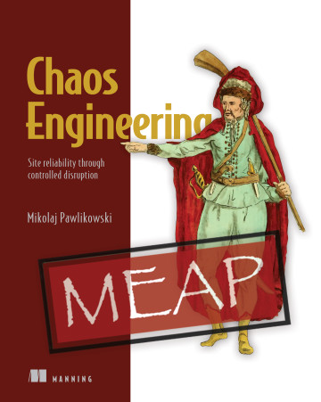

# Chaos Engineering: Site reliability through controlled disruption


**本书仅作为学习、了解、推广Chaos Engineering而摘录，仅可用于个人学习。本书的前9章可以[点击PDF链接](/shares/Chaos-Engineering.pdf)下载。**

**您不可以在网络、论坛以及各类社交媒体分享、传播该链接。**

**希望大家尽可能阅读或购买该书的（[购买链接](https://www.manning.com/books/chaos-engineering)）以支持作者。**


> Mikolaj Pawlikowski
> 
> MEAP began April 2020  Publication in Spring 2021 (estimated)
> 
> ISBN 9781617297755  410 pages (estimated)  printed in black & white
 

> This book is like the Swiss Army knife of chaos engineering. If you need to “break” your app, this book will have a tool that will help you with that.
> 
> Alessandro Campeis

Auto engineers test the safety of a car by intentionally crashing it and carefully observing the results. Chaos engineering applies the same principles to software systems. In Chaos Engineering: Site reliability through controlled disruption, you’ll learn to run your applications and infrastructure through a series of tests that simulate real-life failures. You’ll maximize the benefits of chaos engineering by learning to think like a chaos engineer, and how to design the proper experiments to ensure the reliability of your software. With examples that cover a whole spectrum of software, you’ll be ready to run an intensive testing regime on anything from a simple WordPress site to a massive distributed system running on Kubernetes.

## about the technology
Rather than just looking for code bugs and errors, chaos engineering sees how your software responds to calamity, including partial infrastructure outages, hardware failure, and other major pitfalls that can befall a production system. By observing a system in distress or under attack, chaos engineering ensures the reliability and resiliency of your software—especially for hard-to-test distributed systems with lots of moving parts and little scope for downtime.

## about the book
In Chaos Engineering: Site reliability through controlled disruption you’ll learn to design and execute controlled failure experiments that reveal the hidden problems in your software. Using a toolbox of open source tools, you’ll inject system-shaking failures at every level—from your Docker containers, to your Kubernetes deployment, to the UI. You’ll learn Linux monitoring for observing system metrics and evaluating your results, and even how to apply Chaos Engineering to make your human teams more reliable and resilient to handling failures. Best of all, all tools and examples come with a downloadable Linux VM image, letting you easily experiment without risk to your own systems.

## what's inside
Design, run and analyze Chaos Engineering experiments
See how applications react to a database connections latency
Experiment with Docker container isolation
Test software running on Kubernetes and the platform itself
Inject failure into software running in the HVM
about the reader
For developers with basic knowledge of scripting and Linux.

## about the author
Mikolaj Pawlikowski has been practicing chaos engineering for four years, beginning with a large distributed Kubernetes-based microservices platform at Bloomberg. He is the creator of the Kubernetes Chaos Engineering tool PowerfulSeal, and the networking visibility tool Goldpinger. He is an active member of the Chaos Engineering community and speaks at numerous conferences.

