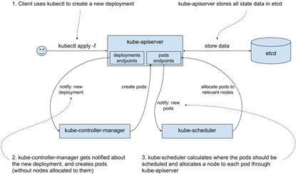
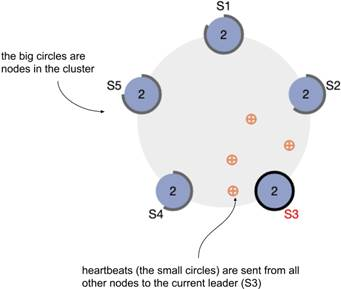
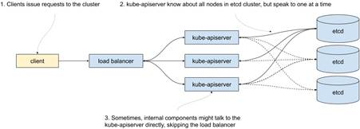
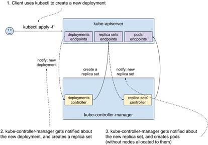
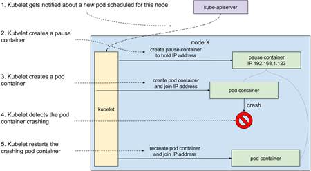
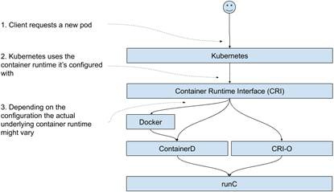
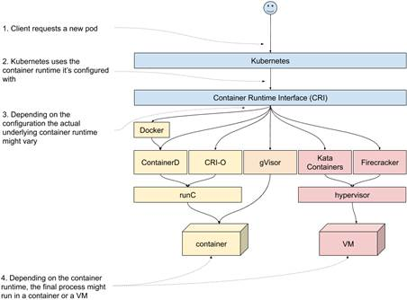
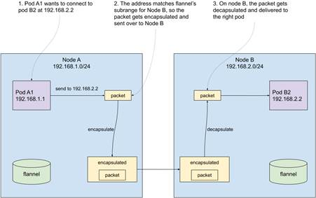

# 12.1 Anatomy of a Kubernetes cluster and how to break it
As I’m writing, Kubernetes is one of the hottest technologies out there. And it’s for a good reason; it solves a whole lot of problems that come from running a large number of applications on large clusters. But like everything else in life, it comes with some costs. One of them is the complexity of the underlying workings of Kubernetes. And although this can be somewhat alleviated by using managed Kubernetes clusters, where most of it is someone else’s problem, you’re never fully insulated from the consequences. And perhaps you’re reading this on your way to a job managing Kubernetes clusters, which is yet another reason to understand how things work.

Regardless of whose problem this is, it’s good to know how Kubernetes works under the hood and how to test it works well. And as you’re about to see, chaos engineering fits neatly right in.


NOTE 

KEEPING UP WITH THE KUBERNETIANS

In this section, I’m going to describe things as they stand for Kubernetes v1.18.3. Kubernetes is a fast-moving target, so even though special care was taken to keep the details in this section as future-proof as possible, things change quickly in Kubernetes Land.


Let’s start at the beginning - with the control plane.

## 12.1.1 Control plane
Kubernetes control plane is the brain of the cluster. It consists of the following components:

* etcd - the database storing all the information about the cluster
* kube-apiserver - the server through which all interactions with the cluster are done, and that stores information in etcd
* kube-controller-manager - implements the infinite loop reading the current state, and attempting to modify it to converge into the desired state
* kube-scheduler - detects newly created pods and assigns them to nodes, taking into account various constraints (affinity, resource requirements, policies, etc)
* kube-cloud-manager (optional) - controls cloud-specific resources (VMs, routing)

In the previous chapter, we created a deployment for Goldpinger. Let’s see, on a high level, what happens under the hood in the control plane when you run a `kubectl apply` command. First, your request reaches the `kube-apiserver` of your cluster. The server validates the request and stores the new or modified resources in `etcd`. In our case, it creates a new deployment resource. Once that’s done, `kube-controller-manager` gets notified of the new deployment. It reads the current state to see what needs to be done, and eventually creates new pods through another call to `kube-apiserver`. Once the `kube-apiserver` stores it in `etcd`, the `kube-scheduler` gets notified about the new pods, picks the best node to run them, assigns the node to them, and updates them back in `kube-apiserver`. As you can see, the `kube-apiserver` is at the center of it all, and all the logic is implemented in asynchronous, eventually consistent loops in loosely connected components. See figure 12.1 for a graphic representation.

Figure 12.1 Kubernetes control plane interactions when creating a deployment

Let’s take a closer look at each of these components and see their strengths and weaknesses, starting with etcd.

### etcd
Legend has it that etcd (https://etcd.io/) was first written by an intern at a company called CoreOS that was bought by Red Hat that was acquired by IBM. Talk about bigger fish eating smaller fish. If the legend is to be believed, it was an exercise in implementing a distributed consensus algorithm called Raft (https://raft.github.io/). What does consensus have to do with etcd?

Four words: availability and fault tolerance. Earlier in this chapter, we spoke about mean time to failure (MTTF) and how with just 20 servers, you were playing Russian roulette with 0.05% probability of losing your data every day. If you have only a single copy of the data, when it’s gone it’s gone. We want a system that’s immune to that. That’s fault tolerance.

Similarly, if you have a single server, if it’s down your system is down. We want a system that’s immune to that. That’s availability.

In order to achieve fault tolerance and availability, there isn’t really much else that you can do other than run multiple copies. And that’s where you run into trouble: the multiple copies have to somehow agree on a version of reality. In other words, they need to reach a consensus.

Consensus is agreeing on watching a movie on Netflix. If you’re by yourself, there is no one to argue with. When you’re with your partner, it becomes almost impossible, because neither of you can gather a majority for a particular choice. That’s when power moves and barter comes into play. But if you add a third person, then whoever convinces them gains a majority and wins the argument.

That’s pretty much exactly how Raft (and by extension, etcd) works. Instead of running a single etcd instance, you run a cluster with an odd number of nodes (typically three or five) and then the instances use the consensus algorithm to decide on the leader who basically makes all decisions while in power. If the leader stops responding (Raft uses a system of heartbeats, or regular calls between all instances, to detect that), a new election begins where everyone announces their candidacy, votes for themselves, and waits for other votes to come in. Whoever gets a majority of votes assumes power. The best thing about Raft is that it’s relatively easy to understand. The second best thing about Raft is that it works.

If you'd like to see the algorithm in action, their official website has a very nice animation with heartbeats represented as little balls flying between bigger balls representing nodes (https://raft.github.io/). I took a screenshot showing a five-node-cluster (S1 to S5) in figure 12.2. It’s also interactive, so you can take nodes down and see how the rest of the system copes.

Figure 12.2 Animation showing Raft consensus algorithm in action (https://raft.github.io/)

I could talk (and I have talked) about etcd and Raft all day, but let’s focus on what’s important from the chaos engineering perspective. Etcd holds pretty much all of the data about a Kubernetes cluster. It’s strongly consistent, meaning that the data you write to etcd is replicated to all nodes, and regardless of which node you connect to, you get the up-to-date data. The price you pay for that is in performance. Typically you’ll be running in clusters of three or five nodes, because that tends to give enough fault tolerance and any extra nodes just slow the cluster down with little benefit. And odd numbers of members are better, because they actually decrease fault tolerance.

Take a three-node cluster for example. To achieve a quorum, you need a majority of two nodes (n/2+1 = 3/2+1 = 2). Or looking at it from the availability perspective, you can lose a single node and your cluster keeps working. Now, if you add an extra node for a total of four, now you need a majority of three to function. That means that you still can survive only a single node failure at a time, but you now have more nodes in the cluster that can fail, so overall you are worse off in terms of fault tolerance.

Running etcd reliably is not easy. It requires an understanding of your hardware profiles, tweaking various parameters accordingly, continuous monitoring, and keeping up to date with bug fixes and improvements in etcd itself. It also requires building an understanding of what actually happens when failure occurs and whether the cluster heals correctly. And that’s where chaos engineering can really shine. The way that etcd is run varies from one Kubernetes offering to another, so the details will vary too, but here are a few high-level ideas:

1. Experiment 1: in a three-node cluster take down a single etcd instance
    * Does kubectl still work? Can you schedule, modify and scale new pods?
    * Do you see any failures connecting to etcd? Etcd clients are expected to retry their requests to another instance, if the one they connected to doesn’t respond
    * When you take the node back up, does the etcd cluster recover? How long does it take?
    * Can you see the new leader election and small increase in traffic in your monitoring setup?
2. Experiment 2: restrict resources (CPU) available to an etcd instance to simulate an unusually high load on the machine running the instance
    * Does the cluster still work?
    * Does the cluster slow down? By how much?
3. Experiment 3: add a networking delay to a single etcd instance
    * Does a single slow instance affect the overall performance?
    * Can you see the slowness in your monitoring setup? Will you be alerted if that happens? Does your dashboard show how close the values are to the limits (the values causing timeouts)?
4. Experiment 4: take down enough nodes for the etcd cluster to lose quorum
    * Does kubectl still work?
    * Do the pods already on the cluster keep running?
    * Does healing work?
        * If you kill a pod, is it restarted?
        * If you delete a pod managed by a deployment, will a new pod be created?

This book gives you all the tools you need to implement all of these experiments and more. Etcd is the memory of your cluster, so it’s crucial to test it well. And if you’re using a managed Kubernetes offering, you’re trusting that the people responsible for running your clusters know the answers to all these questions (and that they can prove it with experimental data). Ask them. If they’re taking your money, they should be able to give you reasonable answers!

Hopefully that’s enough for a primer on etcd. Let’s pull the thread a little bit more and look at the only thing actually speaking to etcd in your cluster - the kube-apiserver.

### kube-apiserver
The kube-apiserver, true to its name, provides a set of APIs to read and modify the state of your cluster. Every component interacting with the cluster does so through the kube-apiserver. For availability reasons, kube-apiserver also needs to be run in multiple copies. But because all the state is stored in etcd and etcd takes care of its consistency, kube-apiserver can be stateless. That means that running it is much simpler, and as long as there are enough instances running to handle the load of requests, we’re good. There is no need to worry about majorities or anything like that. It also means that they can be load-balanced, although some internal components are often configured to skip the load balancer. Figure 12.3 shows what this typically looks like.

Figure 12.3 Etcd and kube-apiserver

From the chaos engineering perspective, you might be interested in knowing how slowness on the kube-apiserver affects the overall performance of the cluster. Here are a few ideas:

1. Experiment 1: create traffic to the kube-apiserver
    * Since everything, including the internal components responsible for creating, updating and scheduling resources, talks to kube-apiserver, creating enough traffic to keep it busy could affect how the cluster behaves.
2. Experiment 2: add network slowness
    * Similarly, adding a networking delay in front of the proxy could lead to build up of queuing of new requests and adversely affect the cluster.

Overall, you will find kube-apiserver start up quickly and perform pretty well. Despite the amount of work that it does, running it is pretty lightweight. Next in the line, the kube-controller-manager.

### kube-controller-manager
Kube-controller-manager implements the infinite control loop, continuously detecting changes in the cluster state and reacting to them to move it toward the desired state. You can think of it as a collection of loops, each handling a particular type of resource.

Do you remember when you created a deployment with kubectl in the previous chapter? What actually happened is that kubectl connected to an instance of kube-apiserver and requested creation of a new resource of type deployment. That was picked up by kube-controller-manager, which in turn created a `ReplicaSet`. The purpose of the latter is to manage a set of pods, ensuring that the desired number runs on the cluster. How is it done? You guessed it: a replica set controller (part of kube-controller-manager) picks it up and creates pods. Both the notification mechanism (called watch in Kubernetes) and the updates are served by the kube-apiserver. See figure 12.4 for a graphical representation. A similar cascade happens when a deployment is updated or deleted; the corresponding controllers get notified about the change and do their bit.

Figure 12.4 Kubernetes control plane interactions when creating a deployment - more details

This loosely coupled setup allows for separation of responsibilities; each controller does only one thing. It is also the heart of Kubernetes’ ability to heal from failure. Any discrepancies from the desired state will be attempted to be corrected ad infinitum.

Like kube-apiserver, kube-controller-manager is typically run in multiple copies for failure resilience. Unlike kube-apiserver, only one of the copies is actually doing work at a time. The instances agree between themselves on who the leader is through acquiring a lease in etcd.

How does that work? Thanks to its property of strong consistency, etcd can be used as a leader-election mechanism. In fact, its API allows for acquiring what they call a lock - a distributed mutex with an expiration date. Let’s say that you run three instances of the kube-controller manager. If all three try to acquire the lease simultaneously, only one will succeed. The lease then needs to be renewed before it expires. If the leader stops working or disappears, the lease will expire and another copy will acquire it. Once again, etcd comes in handy and allows for offloading a difficult problem (leader election) and keeping the component relatively simple.

From the chaos engineering perspective, here are some ideas of experiments:

1. Experiment 1: how busy your kube-apiserver is may affect the speed at which your cluster converges towards the desired state
    * Kube-controller-manager gets all its information about the cluster from kube-apiserver. It’s worth understanding how any extra traffic on kube-apiserver affects the speed at which your cluster is converging towards the desired state. At what point does kube-controller-manager start timing out, rendering the cluster broken?
2. Experiment 2: how your lease expiry affects how quickly the cluster recovers from losing the leader instance of kube-controller-manager
    * If you run your own Kubernetes cluster, you can choose various timeouts for this component. That includes the expiry time of the leadership lease. A shorter value will increase speed at which the cluster restarts converging towards the desired state after losing the leader kube-controller-manager, but it comes at a price of increased load on kube-apiserver and etcd. A larger value

When kube-controller-manager is done reacting to the new deployment, the pods are created, but they aren’t scheduled anywhere. That’s where kube-scheduler comes in.

### kube-scheduler
Like we mentioned earlier, kube-scheduler’s job is to detect pods that haven’t been scheduled on any nodes, and find them a new home. It might be brand new pods, or it might be that a node that used to run the pod went down and a replacement is needed.

Every time the kube-scheduler assigns a pod to run on a particular node in the cluster, it tries to find a best fit. Finding the best fit consists of two steps:

1. filter out the nodes that don’t satisfy the pod’s requirements
2. rank the remaining nodes by a giving them scores based on a predefined list of priorities


INFO

If you’d like to know the details of the algorithm used by the latest version of the kube-scheduler, you can see it in https://github.com/kubernetes/community/blob/master/contributors/devel/sig-scheduling/scheduler_algorithm.md.


For a quick overview, the filters include:

* check that the resources (CPU, RAM, disk) requested by the pod can fit in the node
* check that any ports requested on the host are available on the node
* check if the pod is supposed to run on a node with a particular hostname
* check that the affinity (or anti-affinity) requested by the pod matches (or doesn’t match) the node
* check that the node is not under memory or disk pressure

The priorities taken into account when ranking nodes include:

* the highest amount of free resources after scheduling (the higher the better - this has the effect of enforcing spreading)
* balance between the CPU and memory utilization (the more balanced the better)
* anti-affinity - nodes matching the anti-affinity setting are least preferred
* image locality - nodes already having the image are preferred (this has the effect of minimizing the amount of downloads of images)

Just like kube-controller-manager, a cluster typically runs multiple copies of kube-scheduler but only the leader actually does the scheduling at any given time. From the chaos engineering perspective, this component is prone to basically the same issues as the kube-controller-manager.

From the moment you ran the `kubectl apply` command, the components you just saw worked together to figure out how to move your cluster towards the new state you requested (the state with a new deployment). At the end of that process, the new pods were scheduled, assigned a node to run. But so far, we haven’t seen the actual component that starts the newly scheduled process. Time to take a look at Kubelet.


NOTE 

POP QUIZ: WHERE IS THE CLUSTER DATA STORED?

Pick one:

1. Spread across the various components on the cluster
2. In /var/kubernetes/state.json
3. In etcd
4. In the cloud, uploaded using the latest AI and machine learning algorithms and leveraging the revolutionary power of blockchain technology

See appendix B for answers.



NOTE 

POP QUIZ: WHAT’S THE CONTROL PLANE IN KUBERNETES JARGON?

Pick one:

1. The set of components implementing the logic of Kubernetes converging towards the desired state
2. A remote control aircraft, used in Kubernetes commercials
3. A name for Kubelet and Docker

See appendix B for answers.


## 12.1.2  Kubelet and pause container
Kubelet is the agent starting and stopping containers on a host to implement the pods you requested. Running a Kubelet daemon on a computer turns it into a part of a Kubernetes cluster. Don’t be fooled by the affectionate name; Kubelet is a real workhorse, doing the dirty work ordered by the control plane. Like everything else on a cluster, it reads the state and takes its orders from the kube-apiserver. It also reports the data about the factual state of what’s running on the node, whether it’s running or crashing, how much CPU and RAM is actually used, and more. That data is later leveraged by the control plane to make decisions and make it available to the user.

To illustrate how Kubelet works, let’s do a thought experiment. Let’s say that the deployment we created earlier always crashes within seconds after it starts. The pod is scheduled to be running on a particular node. The Kubelet daemon is notified about the new pod. First, it downloads the requested image. Then, it creates a new container with that image and the specified configuration. In fact, it creates two containers - the one we requested, and another special one called pause. What is the purpose of the pause container?

It’s a pretty neat hack. In Kubernetes, the unit of software is a pod, not a single container. Containers inside a pod need to share certain resources and not others. For example, processes in two containers inside a single pod share the same IP address and can communicate via localhost. Do you remember namespaces from the chapter on Docker? The IP address-sharing is implemented by sharing the network namespace. But other things, like for example the CPU limit, are applicable to each container separately. The reason for pause to exist is simply to hold these resources while the other containers might be crashing and coming back up. The pause container doesn’t do much. It starts and immediately goes to sleep. The name is pretty fitting.

Once the container is up, Kubelet will monitor it. If it crashes, it will bring it back up. See figure 12.5 for a graphical representation of the whole process.

Figure 12.5 Kubelet starting a new pod

When we delete the pod, or perhaps it gets rescheduled somewhere else, Kubelet takes care of removing the relevant containers. Without Kubelet, all the resources created and scheduled by the control plane would remain abstract concepts.

This also makes Kubelet a single point of failure. If it crashes, for whatever reason, , no changes will be made to the containers running on that node, even though Kubernetes will happily accept your changes. They just won’t ever get implemented on that node.

From the perspective of chaos engineering, it’s important to understand what actually happens to the cluster if Kubelet stops working. Here are a few ideas:

1. Experiment 1: after Kubelet dies, how long does it take for pods to get rescheduled somewhere else?
    * When Kubelet stops reporting its readiness to the control plane, after a certain timeout, it’s marked as unavailable (NotReady). That timeout is configurable and defaults to 5 minutes at the time of writing. Pods are not immediately removed from that node. The control plane will wait another configurable timeout before it starts assigning the pods to another node.
    * In a scenario where a node disappears (for example, the hypervisor running the VM crashes), this means that you’re going to need to wait a certain minimal amount of time for the pods to start running somewhere else.
    * If the pod is still running, but for some reason Kubelet can’t connect to the control plane (network partition) or dies, then you’re going to end up with a node running whatever it was running before the event, and it won’t get any updates. One of the possible side-effects is to run extra copies of your software with potentially stale configuration.
    * We’ve covered the tools to take VMs up and down in the previous chapter, as well as killing processes. PowerfulSeal also supports executing commands over SSH, for example to kill or switch off Kubelet.

2. Experiment 2: does Kubelet restart correctly after crashing?
    * Kubelet typically runs directly on the host to minimise the number of dependencies. If it crashes, it should be restarted.
    * As we saw in chapter 2, sometimes setting things up to get restarted is harder than it initially looks, so it’s worth checking that different patterns of crashing (consecutive crashes, time-spaced crashes, and so on) are all covered. This takes little time and can avoid pretty bad outages.

So the question now remains: how exactly does Kubelet run these containers? Let’s take a look at that now.


NOTE 

POP QUIZ: WHICH COMPONENT ACTUALLY STARTS AND STOPS PROCESSES ON THE HOST?

Pick one:

1. kube-apiserver
2. etcd
3. kubelet
4. docker

See appendix B for answers.


## 12.1.3 Kubernetes, Docker, and container runtimes
Kubelet leverages lower-level software to start and stop containers to implement the pods that you ask it to create. This lower-level software is often called container runtimes. In chapter 5, we covered Linux containers and Docker (their most popular representative), and that’s for a good reason. Initially, Kubernetes was written to use Docker directly, and you can still see some naming that matches one-to-one to Docker; even the kubectl CLI feels similar to the Docker CLI.

Today, Docker is still one of the most popular container runtimes to use with Kubernetes, but it’s by no means the only option. Initially, the support for new runtimes was baked directly into Kubernetes internals. In order to make it easier to add new supported container runtimes, a new API was introduced to standardize the interface between Kubernetes and container runtimes. It is called container runtime interface (CRI) and you can read more about how they introduced it in Kubernetes 1.5 in 2016 at https://kubernetes.io/blog/2016/12/container-runtime-interface-cri-in-kubernetes/.

Thanks to that new interface, interesting things happened. For example, since version 1.14, Kubernetes has had Windows support, where it uses Windows containers (https://docs.microsoft.com/en-us/virtualization/windowscontainers/) to start and stop containers on machines running Windows. And on Linux, other options have emerged; for example, the following runtimes leverage basically the same set of underlying technologies as Docker:

* containerd (https://containerd.io/) - the emerging industry standard that seems poised to eventually replace Docker. To make matters more confusing, Docker versions >= 1.11.0 actually use containerd under the hood to run containers
* CRI-O (https://cri-o.io/) - aims to provide a simple, lightweight container runtime optimized for use with Kubernetes
* rkt (https://coreos.com/rkt) - initially developed by CoreOS, the project now appears to be no longer maintained. It was pronounced “rocket”.

To further the confusion, the ecosystem has some more surprises for you. First, both containerd (and therefore Docker, which relies on it) and CRIO-O share some code by leveraging another open-source project called runC (https://github.com/opencontainers/runc), which manages the lower-level aspects of running a Linux container. Visually, when you stack the blocks on top of one another, it looks like figure 12.6. The user requests a pod, Kubernetes reaches out to the container runtime it was configured with. It might go to Docker, Containerd, or CRI-O, but at the end of the day it all ends up using runC.

Figure 12.6 Container Runtime Interface, Docker, Containerd, CRI-O and runC.

The second surprise is that in order to avoid having different standards pushed by different entities, a bunch of companies led by Docker came together to form the Open Container Initiative (or OCI for short https://opencontainers.org/). It provides two specifications:

1. the Runtime Specification that describes how to run a filesystem bundle (new term to describe what used to be called a Docker image downloaded and unpacked)
2. the Image Specification that describes what an OCI Image (new term for Docker image) looks like, how to build, upload, and download one

As you might imagine, most people didn’t just stop using names like Docker images and start prepending everything with OCI, so things can get a little bit confusing at times. But that’s all right. At least there is a standard now!

One more plot twist. In recent years, we’ve seen a few interesting projects pop up, that implement the CRI, but instead of running Docker-style Linux containers, get creative:

* Kata Containers (https://katacontainers.io/) - runs “lightweight VMs” instead of containers, that are optimized for speed, to offer a “container-like” experience, but with stronger isolation offered by different hypervisors
* Firecracker (https://github.com/firecracker-microvm/firecracker) - runs “microVMs”, also lightweight type of VMs, implemented using Linux Kernel Virtual Machine (KVM - https://en.wikipedia.org/wiki/Kernel-based_Virtual_Machine). The idea is the same as Kata Containers, with a different implementation.
* gVisor (https://github.com/google/gvisor) - implements container isolation in a different way than Docker-style projects do. It runs a user space kernel that implements a subset of syscalls that it makes available to the processes running inside of the sandbox. It then sets things up to capture the syscalls made by the process and execute them in the user space kernel. Unfortunately, that capture and redirection of syscalls introduce a performance penalty. There are multiple mechanisms you can use to do that, but the default leverages `ptrace` that we briefly mention in the chapter on syscalls, and so it takes a serious performance hit.

Now, if we plug these into the previous figure, we end up with something along the lines of figure 12.7. Once again, the user requests a pod, and Kubernetes makes a call through the CRI. But this time, depending on which container runtime you are using, the end process might be running in a container or a VM.

Figure 12.7 RunC-based container runtimes, alongside Kata Containers, FIrecracker and gVisor.

If you’re running Docker as your container runtime, everything you learned in chapter 5 will be directly applicable to your Kuberentes cluster. If you’re using ContainerD or CRI-O, it will be mostly the same, because they all use the same underlying technologies. GVisor will differ in many aspects, because of the different approach they chose to implement the isolation. If your cluster uses Kata Containers or Firecracker, you’re going to be running VMs rather than containers. This is a fast-changing landscape, so it’s worth following the new developments in this zone. Unfortunately, as much as I love these technologies, we need to wrap up. I strongly encourage you to at least play around with them.

Let’s take a look at the last piece of the puzzle - the Kubernetes networking model.


NOTE 

POP QUIZ: CAN YOU USE A DIFFERENT CONTAINER RUNTIME THAN DOCKER?

Pick one:

1. If you’re in the USA, it depends on the state. Some states allow it
2. No, Docker is required for running Kubernetes
3. Yes, you can use a number of alternative container runtimes, like CRI-O, containerd and others

See appendix B for answers.


## 12.1.4 Kubernetes networking
There are three parts of Kubernetes networking that you need to understand to be effective as a chaos engineering practitioner:

1. pod-to-pod networking
2. service networking
3. ingress networking

I’ll walk you through them one by one. Let’s start with pod-to-pod networking.

### Pod-to-pod networking
To communicate between pods, or have any traffic routed to them, pods need to be able to resolve each other’s IP addresses. When discussing kubelet, we mentioned that the pause container was holding the IP address that was common for the whole pod. But where does this IP address come from, and how does it work?

The answer is simple. It’s a made-up IP address that's assigned to the pod by Kubelet when it starts. When configuring a Kubernetes cluster, a certain range of IP addresses is configured, and then subranges are given to every node in the cluster. Kubelet is then aware of that subrange, and when it creates a pod through the CRI, it gives it an IP address from its range. From the perspective of processes running in that pod, they will see that IP address as the address of their networking interface. So far so good.

Unfortunately, by itself, this doesn’t implement any pod-to-pod networking. It merely attributes a fake IP address to every pod, and then stores it in kube-apiserver.

Kubernetes then expects you to configure the networking independently. In fact, it only gives you two conditions that you need to satisfy, and doesn’t really care how you achieve that (https://kubernetes.io/docs/concepts/cluster-administration/networking/#the-kubernetes-network-model):

* all pods can communicate to all other pods on the cluster directly
* processes running on the node can communicate with all pods on that node

This is typically done with an overlay network (https://en.wikipedia.org/wiki/Overlay_network), where the nodes in the cluster are configured to route the fake IP addresses between themselves, and deliver them to the right containers.

Once again, the interface for dealing with the networking has been standardized. It’s called Container Networking Interface (CNI). At the time of writing, there are 29 different options for implementing the networking layer listed in the official documentation (https://kubernetes.io/docs/concepts/cluster-administration/networking/#how-to-implement-the-kubernetes-networking-model). To keep things simple, I’m going to show you an example of how one of the most basic works: flannel (https://github.com/coreos/flannel).

Flannel runs a daemon (flanneld) on each Kubernetes node and agrees on subranges of IP addresses that should be available to each node. It stores that information in etcd. Every instance of the daemon then ensures that the networking is configured to forward packets from different ranges to their respective nodes. On the other end, the receiving flanneld daemon delivers received packets to the right container. The forwarding is done using one of the supported existing backends, for example VXLAN (https://en.wikipedia.org/wiki/Virtual_Extensible_LAN).

To make it easier to understand, let’s walk through a concrete example. Let’s say that your cluster has two nodes, and the overall pod IP address range is 192.168.0.0/16. To keep things simple, let’s say that node A was assigned range 192.168.1.0/24 and node B was assigned range 192.168.2.0/24. And node A has a pod A1, with an address 192.168.1.1 and it wants to send a packet to pod B2, with an address 192.168.2.2 running on node B.

When pod A1 tries to connect to pod B2, the forwarding set up by flannel will match the node IP address range for node B and encapsulate and forward the packets there. On the receiving end, the instance of flannel running on node B will receive the packets, undo the encapsulation, and deliver them to pod B. From the perspective of a pod, our fake IP addresses are as real as anything else. Take a look at figure 12.8 that shows this in a graphical way.

Figure 12.8 High-level overview of pod networking with flannel

Flannel is pretty bare-bones. There are much more advanced solutions, doing things like allowing for dynamic policies that dictate which pods can talk to what other pods in what circumstances, and much more. But the high-level idea is the same: the pod IP addresses get routed, and there is a daemon running on each node that makes sure that happens. And that daemon will always be a fragile part of the setup.If it stops working, the networking settings will be stale and potentially wrong.

That’s the pod networking in a nutshell. There is another set of fake IP addresses in Kubernetes - service IP addresses. Let’s take a look at that now.

### Service networking
As a reminder, services in Kubernetes give a shared IP address to a set of pods that you can mix and match based on the labels. In our previous example, we had some pods with a label `app=goldpinger:` the service used that same label to match the pods and give them a single IP address.

Just like the pod IP addresses, the service IP addresses are completely made-up. They are implemented by a component called kube-proxy, that also runs on each node on your Kubernetes cluster. Kube-proxy watches for changes to the pods matching the particular label, and reconfigures the host to route these fake IP addresses to their respective destinations. They also offer some load-balancing. The single service IP address will resolve to many pod IP addresses, and depending on how kube-proxy is configured, you can load-balance them in different fashions.

Kube-proxy can use multiple backends to implement the networking changes. One of them is to use iptables (https://en.wikipedia.org/wiki/Iptables). We don’t have time to dive into how iptables works, but at the high level, it allows you to write a set of rules that modify the flow of the packets on the machine.

In this mode, kube-proxy will create rules that forward the packets to particular pod IP addresses. If there is more than one pod, there will be rules for each pod, with corresponding probabilities. The first rule to match wins. Let’s say that you have a service that resolves to three pods. On a high level, they would look something like this:

1. if IP == SERVICE_IP, forward to pod A with probability 33%
2. if IP == SERVICE_IP, forward to pod B with probability 50%
3. if IP == SERVICE_IP, forward to pod C with probability 100%

This way, on average, the traffic should be routed roughly equally to the three pods.

The weakness of this setup is that iptables evaluates all the rules one by one, until it hits a rule that matches. As you can imagine, the pod services and pods you’re running on your cluster, the more rules there will be, and therefore the bigger overhead this will create.

To alleviate that problem, kube-proxy can also use IPVS (https://en.wikipedia.org/wiki/IP_Virtual_Server), which scales much better for large deployments.

From the chaos engineering perspective, that’s one of the things you need to be aware of. Here are a few ideas for chaos experiments:

1. Experiment 1: does number of services affect the speed of networking?
    * If you’re using iptables, you will find that just creating a few thousand services (even if they’re empty) will suddenly slow down the networking on all nodes in a significant way. Do you think your cluster shouldn’t be affected by that? You’re one experiment away from checking that.
2. Experiment 2: how good is the load-balancing?
    * With the probability-based load balancing, you might sometimes find interesting results in terms of traffic split. It might be a good idea to verify your assumptions about that.
3. Experiment 3: what happens when kube-proxy is down?
    * If the networking is not updated, it is quite possible to end up with not only stale routing that doesn’t work, but also routing to the wrong service. Can your setup detect when that happens? Would you get alerted, if requests start flowing to the wrong destinations?

Once you have a service configured, one last thing that you want to do with it is to make it accessible outside the cluster. That’s what ingresses are designed for. Let’s take a look at that now.

### Ingress networking
Having the routing work inside of the cluster is great, but the cluster won’t be of much use if you can’t access the software running on it from the outside. That’s where the ingresses come in.

In Kubernetes, an ingress is a natively supported resource that effectively describes a set of hosts and the destination service that these hosts should be routed to. For example, an ingress could say that requests for example.com should go to a service called example, in the namespace called mynamespace, and route to port 8080. It’s a first-class citizen, natively supported by Kubernetes API.

But once again, creating this kind of resource doesn’t do anything by itself. You need to have an ingress controller installed that will listen on changes to the resources of this kind and implement them. And yes, you guessed it, there are multiple options. As I’m looking at it now, the official docs list 15 options at https://kubernetes.io/docs/concepts/services-networking/ingress-controllers/.

Let me use the nginx ingress controller (https://github.com/kubernetes/ingress-nginx) as an example. We saw nginx in the previous chapters. It’s often used as a reverse proxy, receiving traffic and sending it to some kind of server upstream. That’s precisely how it’s used in the ingress controller.

When you deploy it, it runs a pod on each host. Inside of that pod, it runs an instance of nginx, and an extra process that listens to changes on resources of type ingress. Every time a change is detected, it re-generates a config for nginx, and asks nginx to reload it. Nginx then knows which hosts to listen on, and where to proxy the incoming traffic. It’s that simple.

It goes without saying, that the ingress controller is typically the single point of entry to the cluster, and so everything that prevents it from working well will deeply affect the cluster. And like any proxy, it’s easy to mess up its parameters. From the chaos engineering perspective, here are some ideas to get you started:

1. What happens when a new ingress is created or modified and a config is reloaded? Are the existing connections dropped? What about corner cases like websockets?
2. Does your proxy have the same timeout as the service it proxies to? If you time out quicker, not only you can have outstanding requests being processed long after the proxy dropped the connection, but the consequent retries might accumulate and take down the target service.

We could chat about that for a whole day, but this should be enough to get you started with your testing. Unfortunately, all good things come to an end. Let’s finish with a summary of the key components we covered in this chapter.


NOTE 

POP QUIZ: WHICH COMPONENT DID I JUST MAKE UP?

Pick one:

1. kube-apiserver
2. kube-controller-manager
3. kube-scheduler
4. kube-converge-loop
5. kubelet
6. etcd
7. kube-proxy

See appendix B for answers.
