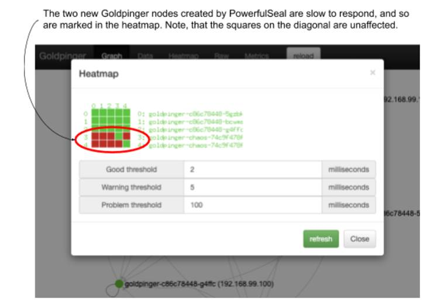

# 11.1 Automating chaos with PowerfulSeal
It’s often said that software engineering is one of the very few jobs where being lazy is a good thing. And I tend to agree with that; a lot of automation or reducing toil can be seen as a manifestation of being too lazy to do manual labor. Automation also reduces operator errors and improves speed and accuracy.

The tools for automation of chaos experiments are steadily becoming more advanced and mature. For a good, up-to-date list of available tools, it’s worth checking out the Awesome Chaos Engineering list (https://github.com/dastergon/awesome-chaos-engineering). For Kubernetes, I recommend PowerfulSeal (https://github.com/powerfulseal/powerfulseal), created by yours truly, that we’re going to use here. Other good options include Chaos Toolkit (https://github.com/chaostoolkit/chaostoolkit) and Litmus (https://litmuschaos.io/).

In this section, we’re going to build on the two experiments we implemented manually to make you more efficient the next time. In fact, we’re going to re-implement a slight variation of these experiments, each in 5 minutes flat. So, what’s PowerfulSeal again?

## 11.1.1 What’s PowerfulSeal?
PowerfulSeal is a chaos engineering tool for Kubernetes. It has quite a few features:

* interactive mode helping you understand how software on your cluster works and manually break it
* integrating with your cloud provider to take VMs up and down
* automatically killing pods marked with special labels
* autonomous mode supporting sophisticated scenarios

The latter point in this list is the functionality we’ll focus on here.

The autonomous mode allows you to implement chaos experiments by writing a simple .yml file. Inside that file, you can write any number of scenarios, each listing the steps necessary to implement, validate, and clean up after your experiment. There are plenty of options you can use (documented at https://powerfulseal.github.io/powerfulseal/policies), but at its heart, it’s a very simple format. The .yml file containing scenarios is referred to as a policy file.

To give you an example, take a look at listing 11.1. It contains a simple policy file, with a single scenario, with a single step. That single step is an HTTP probe. It will try to make an HTTP request to the designated endpoint of the specified service, and fail the scenario if that doesn’t work.

```yaml
Listing 11.1 powerfulseal-policy-minimal.yml
scenarios:
- name: Just check that my service responds
  steps:
  - probeHTTP:                   #A
      target:
        service:
          name: my-service       #B
          namespace: myapp
      endpoint: /healthz         #C
```

\#A instruct PowerfulSeal to conduct an HTTP probe

\#B target service my-service in namespace myapp

\#C call the /healthz endpoint on that service

Once you have your policy file ready, there are many ways you can run PowerfulSeal. Typically, it tends to be used either from your local machine -- the same one you use to interact with the Kubernetes cluster (useful for development) -- or as a Deployment running directly on the cluster (useful for ongoing, continuous experiments).

To run, PowerfulSeal needs permission to interact with the Kubernetes cluster, either through a ServiceAccount, like we did with Goldpinger in chapter 10, or through specifying a kubectl config file. If you want to manipulate VMs in your cluster, you’ll also need to configure access to the cloud provider. With that, you can start PowerfulSeal in autonomous mode and let it execute your scenario. PowerfulSeal will go through the policy and execute scenarios step by step, killing pods and taking down VMs as appropriate. Take a look at figure 11.1 that shows what this setup looks like visually.

Figure 11.1 Setting up PowerfulSeal


And that’s it. Point it at a cluster, tell it what your experiment is like, and watch it do the work for you! We’re almost ready to get our hands dirty, but before we do, we’ll need to install PowerfulSeal.


**NOTE POP QUIZ: WHAT DOES POWEFULSEAL DO?**

Pick one:

1. Illustrates - in equal measures - the importance and futility of trying to pick up good names in software
2. Guesses what kind of chaos you might need by looking at your Kubernetes clusters
3. Allows you to write a Yaml file to describe how to run and validate chaos experiments

See appendix B for answers.


## 11.1.2 PowerfulSeal - installation
PowerfulSeal is written in Python, and it’s distributed in two forms:

* a pip package called `powerfulseal`
* a Docker image called `powerfulseal/powerfulseal` on Docker Hub

For the two examples we’re going to run, it will be much easier to run PowerfulSeal locally, so let’s install it through pip. It requires Python3.7+ and pip available.

To install it using a virtualenv (recommended), run the following commands in a terminal window to create a subfolder called env and install everything in it:

```
python3 --version                #A
python3 -m virtualenv env        #B
source env/bin/activate          #C
pip install powerfulseal         #D
```

\#A check the version to make sure it’s python3.7

\#B create a new virtualenv in the current working directory, called env

\#C activate the new virtualenv

\#D install powerfulseal from pip

Depending on your internet connection, the last step might take a minute or two. When it’s done, you will have a new command accessible, called powerfulseal. Try it out by running the following command:

```
powerfulseal --version
```

You will see the version printed, corresponding to the latest version available. If, at any point, you need help, feel free to consult the help pages of PowerfulSeal, by running the following command:

```
powerfulseal --help
```

With that, we’re ready to roll. Let’s see what experiment 1 would look like using PowerfulSeal.

## 11.1.3 Experiment 1b: kill 50% of pods
As a reminder, this was our plan for experiment 1:

1. Observability: use Goldpinger UI to see if there are any pods marked as inaccessible; use kubectl to see new pods come and go
2. Steady state: all nodes healthy
3. Hypothesis: if we delete one pod, we should see it in marked as failed in Goldpinger UI, and then be replaced by a new, healthy pod
4. Run the experiment

We have already covered the observability, but if you closed the browser window with the Goldpinger UI, here’s a refresher. Open the Goldpinger UI by running the following command in a terminal window:

```
minikube service goldpinger
```

And just like before, we’d like to have a way to see what pods were created and deleted. To do that, we leverage the --watch flag of the `kubectl get pods` command. In another terminal window, start a kubectl command to print all changes:

```
kubectl get pods --watch
```

Now, to the actual experiment. Fortunately, it translates one-to-one to a built-in feature of PowefulSeal. Actions on pods are done using `PodAction` (I’m good at naming like that). Every PodAction consists of three steps:

* match some pods, for example based on labels
* filter the pods (various filters available, for example take a 50% subset)
* apply an action on pods (for example, kill them)

This translates directly into experiment1b.yml that you can see in listing 11.2. Store it or clone it from the repo.

```yaml
Listing 11.2 experiment1b.yml
config:
  runStrategy:
    runs: 1                                      #A
scenarios:
- name: Kill 50% of Goldpinger nodes
  steps:
  - podAction:
      matches:                                   #B
        - labels:
            selector: app=goldpinger
            namespace: default
      filters:                                   #C
        - randomSample:
            ratio: 0.5
      actions:                                   #D
        - kill:
            force: true
```

\#A only run the scenario once, and then exit

\#B select all pods in namespace default, with labels app=goldpinger

\#C filter out to only take 50% of the matched pods

\#D kill the pods

You must be itching to run it, so let’s not wait any longer. On Minikube, the kubectl config is stored in ~/.kube/config, and it will be automatically picked up when you run PowerfulSeal. So the only argument we need to specify is the policy file (`--policy-file`) flag. Run the following command, pointing to the experiment1b.yml file:

```
powerfulseal autonomous --policy-file experiment1b.yml
```

You will see an output similar to the following (abbreviated). Note the lines when it says it found three pods, filtered out two and selected a pod to be killed (bold font):

```
(...) 
  2020-08-25 09:51:20 INFO __main__ STARTING AUTONOMOUS MODE 
  2020-08-25 09:51:20 INFO scenario.Kill 50% of Gol Starting scenario 'Kill 50% of Goldpinger nodes' (1 steps) 
  2020-08-25 09:51:20 INFO action_nodes_pods.Kill 50% of Gol Matching 'labels' {'labels': {'selector': 'app=goldpinger', 'namespace': 'default'}} 
  2020-08-25 09:51:20 INFO action_nodes_pods.Kill 50% of Gol Matched 3 pods for selector app=goldpinger in namespace default 
  2020-08-25 09:51:20 INFO action_nodes_pods.Kill 50% of Gol Initial set length: 3 
  2020-08-25 09:51:20 INFO action_nodes_pods.Kill 50% of Gol Filtered set length: 1 
  2020-08-25 09:51:20 INFO action_nodes_pods.Kill 50% of Gol Pod killed: [pod #0 name=goldpinger-c86c78448-8lfqd namespace=default containers=1 ip=172.17.0.3 host_ip=192.168.99.100 state=Running labels:app=goldpinger,pod-template-hash=c86c78448 annotations:] 
  2020-08-25 09:51:20 INFO scenario.Kill 50% of Gol Scenario finished 
  (...)
```

If you’re quick enough, you will see a pod becoming unavailable and then replaced by a new pod in the Goldpinger UI, just like you did the first time we ran this experiment. And in the terminal window running kubectl, you will see the familiar sight, confirming that a pod was killed (`goldpinger-c86c78448-8lfqd`) and then replaced with a new one (`goldpinger-c86c78448-czbkx`):

```
NAME            READY   STATUS    RESTARTS   AGE 
  goldpinger-c86c78448-lwxrq   1/1     Running   1          45h 
  goldpinger-c86c78448-tl9xq   1/1     Running   0          40m 
  goldpinger-c86c78448-xqfvc   1/1     Running   0          8m33s 
  goldpinger-c86c78448-8lfqd   1/1     Terminating   0          41m 
  goldpinger-c86c78448-8lfqd   1/1     Terminating   0          41m 
  goldpinger-c86c78448-czbkx   0/1     Pending       0          0s 
  goldpinger-c86c78448-czbkx   0/1     Pending       0          0s 
  goldpinger-c86c78448-czbkx   0/1     ContainerCreating   0          0s 
  goldpinger-c86c78448-czbkx   1/1     Running             0          2s
```

That concludes the first experiment and shows you the ease of use of higher level tools like PowerfulSeal. But we’re just warming up. Let’s take a look at experiment 2 once again, this time using the new toys.

## 11.1.4 Experiment 2b: network slowness
As a reminder, this was our plan for experiment 2:

1. Observability: use Goldpinger UI to read delays using the graph UI and the heatmap
2. Steady state: all existing Goldpinger instances report healthy
3. Hypothesis: if we add a new instance that has a 250ms delay, the connectivity graph will show all four instances healthy, and the 250ms delay will be visible in the heatmap
4. Run the experiment!

It’s a perfectly good plan, so let’s use it again. But this time, instead of manually setting up a new deployment and doing the gymnastics to point the right port to the right place, we’ll leverage the clone feature of PowerfulSeal.

It works like this. You point it at a source deployment that it will copy at runtime (the deployment must exist on the cluster). This is to make sure that we don’t break the existing running software, and instead add an extra instance, just like we did before. And then you can specify a list of mutations that PowerfulSeal will apply to the deployment to achieve specific goals. Of particular interest is the `toxiproxy` mutation. It does almost exactly the same thing that we did:

* add a toxiproxy container to the deployment
* configure toxiproxy to create a proxy configuration for each port specified on the deployment
* automatically redirect the traffic incoming to each port specified in the original deployment to its corresponding proxy port
* configure any toxics requested

The only real difference between what we did before and what PowefulSeal does is the automatic redirection of ports, which means that we don’t need to change any ports configuration in the deployment.

To implement this scenario using PowerfulSeal, we need to write another policy file. It’s pretty straightforward. We need to use the clone feature, and specify the source deployment to clone. To introduce the network slowness, we can add a mutation of type toxiproxy, with a toxic on port 8080, of type latency, with the latency attribute set to 250ms. And just to show you how easy it is to use, let’s set the number of replicas affected to 2. That means that two replicas out of the total of five (three from the original deployment plus these two), or 40% of the traffic will be affected. Also note that at the end of a scenario, PowerfulSeal cleans up after itself by deleting the clone it created. To give you enough time to look around, let’s add a wait of 120 seconds before that happens.

When translated into Yaml, it looks like the file `experiment2b.yml` that you can see in listing 11.3. Take a look.

```yaml
Listing 11.3 experiment2b.yml
config:
  runStrategy:
    runs: 1
scenarios:
- name: Toxiproxy latency
  steps:
  - clone:                                       #A
source:
        deployment:                              #B
          name: goldpinger
          namespace: default
      replicas: 2                                #C
      mutations:
        - toxiproxy:
            toxics:
              - targetProxy: "8080"              #D
                toxicType: latency
                toxicAttributes:
     - name: latency                             #E
       value: 250
  - wait:
      seconds: 120                               #F
```

\#A use the clone feature of PowerfulSeal

\#B clone the deployment called “goldpinger” in the default namespace

\#C use two replicas of the clone

\#D target port 8080 (the one that Goldpinger is running on)

\#E specify latency of 250ms

\#F wait for 120 seconds


**NOTE BRINGING GOLDPINGER BACK UP AGAIN**

If you got rid of the Goldpinger deployment from experiment 2, you can bring it back up by running the following command in a terminal window:

```
kubectl apply -f goldpinger-rbac.yml
```

```
kubectl apply -f goldpinger.yml
```


You’ll see a confirmation of the created resources. After a few seconds, you will be able to see the Goldpinger UI in the browser by running the following command:

```
minikube service goldpinger
```

You will see the familiar graph with three goldpinger nodes, just like in chapter 10. See figure 11.2 for a reminder of what it looks like.

Figure 11.2 Goldpinger UI in action


Let’s execute the experiment. Run the following command in a terminal window:

```
powerfulseal autonomous --policy-file experiment2b.yml
```

You will see PowerfulSeal creating the clone, and then eventually deleting it, similar to the following output:

```
(...)
2020-08-31 10:49:32 INFO __main__ STARTING AUTONOMOUS MODE 
  2020-08-31 10:49:33 INFO scenario.Toxiproxy laten Starting scenario 'Toxiproxy latency' (2 steps) 
  2020-08-31 10:49:33 INFO action_clone.Toxiproxy laten Clone deployment created successfully 
  2020-08-31 10:49:33 INFO scenario.Toxiproxy laten Sleeping for 120 seconds 
  2020-08-31 10:51:33 INFO scenario.Toxiproxy laten Scenario finished 
  2020-08-31 10:51:33 INFO scenario.Toxiproxy laten Cleanup started (1 items) 
  2020-08-31 10:51:33 INFO action_clone Clone deployment deleted successfully: goldpinger-chaos in default 
  2020-08-31 10:51:33 INFO scenario.Toxiproxy laten Cleanup done 
  2020-08-31 10:51:33 INFO policy_runner All done here!
```

During the 2-minute wait you configured, check the Goldpinger UI. You will see a graph with five nodes. When all pods come up, the graph will show all healthy. But there is more to it. Click the heatmap, and you will see that the cloned pods (they will have “chaos” in their name) are slow to respond. But if you look closely, you will notice that the connections they are making to themselves are unaffected. That’s because PowerfulSeal doesn’t inject itself into communications on localhost. Click the heatmap button. You will see a heatmap similar to figure 11.2. Note that the squares on the diagonal (pods calling themselves) remain unaffected by the added latency.

Figure 11.3 Goldpinger heatmap showing two pods with added latency, injected by PowerfulSeal



That concludes the experiment. Wait for PowerfulSeal to clean up after itself and delete the cloned deployment. When it’s finished (it will exit(, let’s move on to the next topic: ongoing testing.