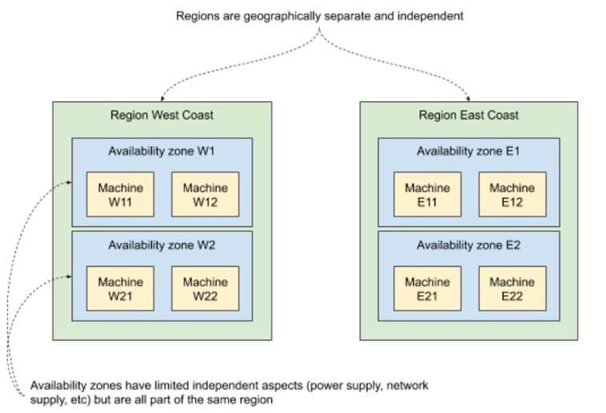

# 11.3 Cloud layer
So far we’ve focused on introducing failure to particular pods running on a Kubernetes cluster -- a bit like a reverse surgical procedure, inserting a problem with high precision. And the ease with which Kubernetes allows us to do that is still making me feel warm and fuzzy inside to this day.

But there is more. If you’re running your cluster in a cloud, private or public, it’s easy to simulate failure on the VM level, by simply taking them up or down. In Kubernetes, a lot of the time you can stop thinking about the machines and data centers that your clusters are built on. But it doesn’t mean that they stop existing. They are very much still there, and you still need to obey the rules of physics governing their behavior. And with bigger scale come bigger problems. Let me show you some napkin maths to explain what I mean.

One of the metrics to express the reliability of a piece of hardware is the Mean Time To Failure (MTTF). It’s the average time that the said hardware runs without failure. It’s typically established empirically by looking at historical data. For example, let’s say that the servers in your datacenter are of good quality, and you have a MTTF time of 5 years. That means that on average, each server will run about 5 years between times it fails. Roughly speaking, on any given day, the chance of failing for each of your servers is 1 in 1826 (5*365 + leap year). That’s 0.05% chance. This is of course a simplification and there are other factors that would need to be taken into account for a serious probability calculation, but this is a good enough estimate for our needs.

Now, depending on your scale you’re going to be more or less exposed to that. If the failures were truly independent in a mathematical sense, with just 20 servers you’d have a daily chance of failure of 1%, or 10% with 200 servers. And if that failed server is running multiple VMs that you use as Kubernetes nodes, you’re going to end up with a chunk of your cluster down. If your scale is in the thousands of servers, the failure is just a daily occurrence.

From a perspective of a chaos-engineering practicing site-reliability engineering (SRE), that means one thing: you should test your system for the kind of failure coming from hardware failure:

* single machines going down and back up
* groups of machines going down and back up
* entire regions/datacenters/zones going down and back up
* network partitions that make it look like other machines are unavailable

Let’s take a look at how we can prepare against this kind of issue.

## 11.3.1 Cloud provider APIs, availability zones
Every cloud provider offers an API you can use to create and modify VMs, including taking them up and down. This includes self-hosted, open-source solutions like OpenStack. They also provide GUIs, CLIs, and libraries and more to integrate best with your existing workflow.

To allow for effective planning against outages, they also structure their hardware by partitioning it using regions (or equivalent) and then again using availability zones (or equivalent) inside of the regions. Why is that?

Typically, regions represent different physical locations, often far away from each other, plugged into separate utilities providers (internet, electricity, water, cooling, and so on). This is to make sure that if something dramatic happens in one region (storm, earthquake, flood), other regions remain unaffected. It limits the blast radius to a single region.

Availability zones are there to further limit that blast radius within a single region. The actual implementations vary, but the idea is to leverage things that are redundant (power supply, internet provider, networking hardware) to put the machines that rely on them in separate groups. For example, if your datacenter has two racks of servers, each plugged into a separate power supply and separate internet supply, you could mark each rack as an availability zone, because failure within the components in one zone won’t affect the other. An example of both regions and availability zones is shown in figure 11.4. The region West Coast has two availability zones (W1 and W2), each running two machines. Similarly, the East Coast region has two availability zones (E1 and E2), each running two machines. A failure of a region wipes out four machines. A failure of an availability zone wipes out two.

Figure 11.5 Regions and availability zones



With this partitioning, software engineers can design their applications to be resilient to the different problems we mentioned earlier:

* spreading your application across multiple regions can make it immune to an entire region going down
* within a region, spreading your application across multiple availability zones can help make it immune to an availability zone going down

To automatically achieve this kind of spreading, we often talk about affinity and anti-affinity. Marking two machines with the same affinity group simply means that they should (soft affinity) or must (hard affinity) be running within the same partition (availability zone, region, others). Anti-affinity is the opposite: items within the same group shouldn’t or mustn't be running in the same partition.

And to make planning easier, the cloud providers often express their SLOs using regions and availability zones -- for example, promising to keep each region up 95% of the time, but at least one region up 99.99% of the time.

Let’s see how you’d go about implementing an on-demand outage to verify your application.

## 11.3.2 Experiment 4: taking VMs down
On Kubernetes, the application you deploy is going to be run on some physical machine somewhere. Most of the time you don’t care which one that is - until you want to ensure a reasonable partitioning in respect to outages. To make sure that multiple replicas of the same application aren’t running on the same availability zones, most Kubernetes providers set labels for each node that can be used for anti-affinity. Kubernetes also allows you to set your own criteria of anti-affinity and will try to schedule pods in a way that respects them.

Let’s assume that you have a reasonable spread, and that you want to see that your application survives the loss of some set of machines. We can take the example of Goldpinger from the previous section. In a real cluster, we would be running an instance per node. Earlier we killed a pod, and we investigated how that was being detected by its peers. Another way of going about that would be to take down a VM and see how the system reacts. Will it be detected as quickly? Will the instance be rescheduled somewhere else? How long will it take for it to recover, once the VM is brought back up? These are all questions we could investigate using this technique.

From the implementation perspective, these experiments can be very simple. In its most crude form, you can log into a GUI, select the machines in question on a list and click Shutdown or write a simple bash script that uses the CLI for a particular cloud. It would absolutely do it.

The only problem with these two approaches is that they are cloud-provider specific, and you might end up reinventing the wheel each time. If only there was an open-source solution supporting all major clouds that let you do that. Oh wait, PowerfulSeal can do that! Let me show you how to use it.

PowerfulSeal supports OpenStack, Amazon Web Services (AWS), Microsoft Azure, and Google Cloud Platform (GCP), and adding a new driver involves implementing a single class with a handful of methods. To make PowerfulSeal take VMs down and bring them back up, you’re going to need to do the two following things:

1. Configure the relevant cloud driver (see `powerfulseal autonomous --help`)
2. Write a policy file that does the VM operations

The cloud drivers are configured in the same way that their respective CLIs are. Unfortunately, our Minikube setup has only a single VM, so it won’t be any good for this section. Let me give you two examples of two different ways of taking VMs down.

First, similar to `podAction`, which we used in the previous experiments, we can use `nodeAction`. It works the same way: it matches, filters and actions on a set of nodes. You can match on names, IP addresses, availability zones, groups, and state. Take a look at listing 11.5, which represents an example policy for taking down a single node from any availability zone starting with “WEST”, then making an example HTTP request to verify that things continue working, and finally cleaning up after itself by restarting the node.

```yaml
Listing 11.5 PowerfulSeal scenario implementing experiment 4a (experiment4a.yml)
config:
  runStrategy:
    runs: 1
scenarios:
- name: Test load-balancing on master nodes
  steps:
  - nodeAction:
      matches:
        - property:
            name: "az"                    #A
            value: "WEST.*"
      filters:
        - randomSample:
            size: 1                       #B
      actions:
        - stop:                           #C
autoRestart: true
  - probeHTTP:                            #D
      target:
        url: "http://load-balancer.example.com"
```

\#A select one VM from any availability zone starting with WEST

\#B select one VM randomly from within the matched set

\#C stop the VM, but auto-restart it at the end of the scenario

\#D make a HTTP request to some kind of URL to confirm that the system keeps working

Second, you can also stop VMs running a particular pod. This can be done using `podAction` to select the pod, and then using `stopHost` action to stop the node that the pod is running on. Listing 11.6 shows an example of how you can achieve that. It selects a random pod from namespace “mynamespace”, and stops the VM that runs it. When it’s done, it automatically restarts it.

```yaml
Listing 11.6 PowerfulSeal scenario implementing experiment 4b (experiment4b.yml)
scenarios:
- name: Stop that host!
  steps:
  - podAction:
      matches:
        - namespace: mynamespace          #A
      filters:
        - randomSample:                   #B
            size: 1
      actions:
        - stopHost:                       #C
autoRestart: true
```

\#A select all pods in namespace “mynamespace”

\#B select one pod randomly from within the matched set

\#C stop the VM, but auto-restart it at the end of the scenario

Both of these policy files work with any of the supported cloud providers. And if you’d like to add another cloud provider, feel free to send pull requests on github to https://github.com/powerfulseal/powerfulseal!

Time to wrap this section up. Hopefully that gives you enough tools and ideas to go forth and improve your cloud-based applications’ reliability. In chapter 12, we’ll take a step deeper into the rabbit hole by looking at how Kubernetes works under the hood.


**NOTE POP QUIZ: WHAT CAN POWERFULSEAL NOT DO FOR YOU?**

Pick one:

1. Kill pods to simulate processes crashing
2. Take VMs up and down to simulate hypervisor failure
3. Clone a deployment and inject simulated network latency into the copy
4. Verify that services respond correctly by generating HTTP requests
5. Fill in the discomfort coming from the realization that if there are indeed infinite universes, there exists, theoretically, a version of you that’s better in every conceivable way, no matter how hard you try

See appendix B for answers.
