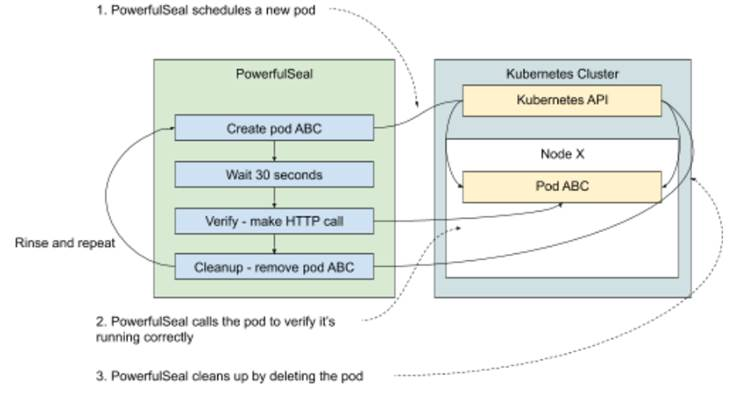

# 11.2 Ongoing testing & Service Level Objectives (SLOs)
So far, all the experiments we’ve conducted were designed to verify a hypothesis and call it a day. Like everything in science, a single counter-example is enough to prove a hypothesis wrong, but absence of such counter-example doesn’t prove anything. And sometimes our hypotheses are about normal functioning of a system, where various events might occur and influence the outcome.

To illustrate what I mean, let me give you an example. Think of a typical Service Level Agreement (SLA) that you might see for a Platform as a Service (PaaS). Let’s say that your product is to offer managed services, similar to AWS Lambda (https://aws.amazon.com/lambda/), where the client can make an API call specifying a location of some code, and your platform will build, deploy, and run that service for them. Your clients care deeply about the speed at which they can deploy new versions of their services, so they want an SLA for the time it takes from their request to their service being ready to serve traffic. To keep things simple, let’s say that the time for building their code is excluded, and the time to deploy it on your platform is agreed to be one minute.

As the engineer responsible for that system, you need to work backward from that constraint to set up the system in a way that can satisfy these requirements. You design an experiment to verify that a typical request you expect to see in your clients fits in that timeline. You run it, turns out it only takes about 30 seconds, the champagne cork is popping and the party starts! Or does it?

When you run the experiment like this and it works, what you actually proved is that the system behaved the expected way during the experiment. But does it guarantee that it will work the same way in different conditions (peak traffic, different usage patterns, different data)? Typically, the larger and more complex the system is, the harder it is to answer that question. And that’s a problem, especially if the SLAs you signed have financial penalties for missing the goals.

Fortunately, chaos engineering really shines in this scenario. Instead of running an experiment once, we can run it continuously to detect any anomalies, experimenting every time on a system in a different state and during the kind of failure we expect to see. Simple yet effective.

Let’s go back to our example. We have a 1-minute deadline to start a new service. Let’s automate an ongoing experiment that starts a new service every few minutes, measures the time it took to become available, and alerts if it exceeds a certain threshold. That threshold will be our internal SLO, which is more aggressive than the legally binding version in the SLA that we signed, so that we can get alerted when we get close to trouble.

It’s a common scenario, so let’s take our time and make it real.

## 11.2.1 Experiment 3: verify pods are ready within (n) seconds of being created
Chances are, that PaaS you’re building is running on Kubernetes. When your client makes a request to your system, it translates into a request for Kubernetes to create a new deployment. You can acknowledge the request to your client, but this is where things start getting tricky. How do you know that the service is ready? In one of the previous experiments we used `kubectl get pods --watch` to print to the console all changes to the state of the pods we cared about. All of them are happening asynchronously, in the background, while Kubernetes is trying to converge to the desired state. In Kubernetes, pods can be in one of the following states:

* pending - the pod has been accepted by Kubernetes, but it’s not been setup yet
* running - the pod has been setup, and at least one container is still running
* succeeded - all containers in the pod have terminated in success
* failed - all containers in the pod have terminated, at least one of them in failure
* unknown - the state of the pod is unknown (typically the node running it stopped reporting its state to Kubernetes)

If everything goes well, the happy path is for a pod to start in pending, and then move to running. But before that happens, a lot of things need to happen, many of which will take a different amount of time every time, for example:

* image download - unless already present on the host, the images for each container need to be downloaded, potentially from a remote location. Depending on the size of the image and on how busy the location from which it needs to be downloaded is at the time, it might take a different amount of time every time. Additionally, like everything on the network, it’s prone to failure and might need to be retried.
* preparing dependencies - before a pod is actually run, Kubernetes might need to prepare some dependencies it relies on, like (potentially large) volumes, configuration files and so on
* actually running the containers - the time to actually start a container will vary, depending on how busy the host machine is

In a not-so-happy path, for example, if an image download gets interrupted, you might end up with a pod going from pending through failed to running. The point is that it can’t easily be predicted how long it’s going to take to actually have it running. So the next best thing we can do is to continuously test it and alert when it gets too close to the threshold we care about.

With PowerfulSeal, it’s very easy to do. We can write a policy that will deploy some example application to run on the cluster, wait the time we expect it to take, and then execute an HTTP request to verify that the application is running correctly. It can also automatically clean the application up when it’s done, and provide means to get alerted when the experiment failed.

Normally, we would add some type of failure, and test that the system withstands that. But right now I just want to illustrate the idea of ongoing experiments, so let’s keep it simple and stick to just verifying our SLO on the system without any disturbance.

Leveraging that, we can design the following experiment:

1. Observability: read PowerfulSeal output (and/or metrics)
2. Steady state: N/A
3. Hypothesis: when I schedule a new pod and a service, it becomes available for HTTP calls within 30 seconds
4. Run the experiment!

That translates into a PowerfulSeal policy that runs indefinitely the following steps:

* create a pod and a service
* wait 30 seconds
* make a call to the service to verify it’s available, fail if it’s not
* clean up (remote the pod and service)
* rinse and repeat

Take a look at figure 11.3 that shows this process visually.

Figure 11.4 Example of an ongoing chaos experiment



To write the actual PowerfulSeal policy file, we’re going to use three more features:

* First, a step of type `kubectl` behaves just like you expect it to: it executes the attached Yaml just like if you did a `kubectl apply` or `kubectl delete`. We’ll use that to create the pods in question. We’ll also use the option for automatic clean up at the end of the scenario, called `autoDelete`.
* Second, we’ll use the wait feature to wait for the 30 seconds we expect to be sufficient to deploy and start the pod.
* Third, we’ll use the `probeHTTP` to make an HTTP request and detect whether it works. `probeHTTP` is fairly flexible; it supports calling services or arbitrary urls, using proxies and more.

We’ll also need an actual test app to deploy and call. Ideally, we’d choose something that represents a reasonable approximation of the type of software that the platform is supposed to handle. To keep things simple, we can deploy a simple version of Goldpinger again. It has an endpoint `/healthz` that we can reach to confirm that it started correctly.

Listing 11.4 shows experiment3.yml, which is what the preceding list looks like when translated into a Yaml file. Note, that unlike in the previous experiments, where we configured the policy to only run once, here we configure it to run continuously (the default) with a 5- to 10-second wait in between runs. Take a look - we’re going to run that file in just a second.

```yaml
Listing 11.4 PowerfulSeal scenario implementing experiment 3 (experiment3.yml)
config:
  runStrategy:
    minSecondsBetweenRuns: 5             #A
    maxSecondsBetweenRuns: 10
scenarios:
- name: Verify pod start SLO
  steps:
  - kubectl:                             #B
      autoDelete: true                   #C
      # equivalent to `kubectl apply -f -`
      action: apply
      payload: |
        ---
        apiVersion: v1
        kind: Pod
        metadata:
          name: slo-test
          labels:
            app: slo-test
        spec:
          containers:
          - name: goldpinger
            image: docker.io/bloomberg/goldpinger:v3.0.0
            env:
            - name: HOST
              value: "0.0.0.0"
            - name: PORT
              value: "8080"
            ports:
            - containerPort: 8080
              name: goldpinger
        ---
        apiVersion: v1
        kind: Service
        metadata:
          name: slo-test
        spec:
          type: LoadBalancer
          ports:
            - port: 8080
              name: goldpinger
          selector:
            app: slo-test
  # wait the minimal time for the SLO
  - wait:                                #D
      seconds: 30
  # make sure the service responds
  - probeHTTP:
      target:
        service:                         #E
          name: slo-test
          namespace: default
          port: 8080
      endpoint: /healthz                #F
```

\#A configure the seal to run continuously with 5-10 wait between runs

\#B the kubectl command is equivalent to kubectl apply -f

\#C clean up whatever was created here at the end of th scenario

\#D wait for the arbitrarily chosen 30 seconds

\#E make an HTTP call to the specified service (the one created above in kubectl section)

\#F call the /healthz endpoint just to verify the server is up and running

We’re almost ready to run this experiment, but have just one caveat to get out of the way. If you’re running this on Minikube, the service IPs that PowerfulSeal uses to make the call in probeHTTP need to be accessible from your local machine. Fortunately, that can be handled by the Minikube binary. To make them accessible, run the following command in a terminal window (it will ask for a sudo password):

```
minikube tunnel
```

After a few seconds, you will see it start to periodically print a confirmation message similar to the following. This is to show you that it detected a service, and that it made local routing changes to your machine to make the IP route correctly. When you stop the process, the changes will be undone:

```
Status: 
          machine: minikube 
          pid: 10091 
          route: 10.96.0.0/12 -> 192.168.99.100 
          minikube: Running 
          services: [goldpinger] 
      errors:  
                  minikube: no errors 
                  router: no errors 
                  loadbalancer emulator: no errors
```

With that, we are ready to run the experiment. Once again, to have a good view of what’s happening to the cluster, let’s start a terminal window and run the kubectl command to watch for changes:

```
kubectl get pods --watch
```

In another window, let’s run the actual experiment. You can do that by running the following command:

```
powerfulseal autonomous --policy-file experiment3.yml
```

PowerfulSeal will start running, and you’ll need to stop it at some point with Ctrl-C. A full cycle of running the experiment will look similar to the following output. Note the lines creating the pod, making the call and getting a response and doing the cleanup (all in bold font):

```
(...) 
  2020-08-26 09:52:23 INFO scenario.Verify pod star Starting scenario 'Verify pod start SLO' (3 steps) 
  2020-08-26 09:52:23 INFO action_kubectl.Verify pod star pod/slo-test created service/slo-test created 
  2020-08-26 09:52:23 INFO action_kubectl.Verify pod star Return code: 0 
  2020-08-26 09:52:23 INFO scenario.Verify pod star Sleeping for 30 seconds 
  2020-08-26 09:52:53 INFO action_probe_http.Verify pod star Making a call: http://10.101.237.29:8080/healthz, get, {}, 1000, 200, , , True 
  2020-08-26 09:52:53 INFO action_probe_http.Verify pod star Response: {"OK":true,"duration-ns":260,"generated-at":"2020-08-26T08:52:53.572Z"} 
  2020-08-26 09:52:53 INFO scenario.Verify pod star Scenario finished 
  2020-08-26 09:52:53 INFO scenario.Verify pod star Cleanup started (1 items) 
  2020-08-26 09:53:06 INFO action_kubectl.Verify pod star pod "slo-test" deleted 
  service "slo-test" deleted  2020-08-26 09:53:06 INFO action_kubectl.Verify pod star Return code: 0 
  2020-08-26 09:53:06 INFO scenario.Verify pod star Cleanup done 
  2020-08-26 09:53:06 INFO policy_runner Sleeping for 8 seconds
```

PowerfulSeal says that the SLO was being respected, which is great. But we only just met, so let’s double-check that it actually deployed (and cleaned up) the right stuff on the cluster. To do that, go back to the terminal window running kubectl. You should see the new pod appear, run and disappear, similar to the following output:

```
slo-test        0/1     Pending   0          0s 
slo-test        0/1     Pending   0          0s 
slo-test        0/1     ContainerCreating   0          0s 
slo-test        1/1     Running             0          1s 
slo-test        1/1     Terminating         0          30s 
slo-test        0/1     Terminating         0          31s
```

So there you have it. With about 50 lines of verbose Yaml, you can describe an ongoing experiment and detect when starting a pod takes longer than 30 seconds. The Goldpinger image is pretty small, so in the real world, you’d pick something that more closely resembles the type of thing that will run on the platform. You could also run multiple scenarios for multiple types of images you expect to deal with. And if you wanted to make sure that the image is downloaded every time, so that you deal with the worst-case scenario, that can easily be achieved by specifying `imagePullPolicy: Always` in your pod’s template (https://kubernetes.io/docs/concepts/configuration/overview/#container-images).

This should give you an idea of what an ongoing, continuously verified experiment can do for you. You can build on that to test other things, including but not limited to the following:

* SLOs around pod healing. If you kill a pod, how long does it take to be rescheduled and ready again?
* SLOs around scaling. If you scale your deployment, how long does it take for the new pods to become available?

As I write this, the weather outside is changing, it’s getting a little bit… cloudy. Let’s take a look at that now.


**NOTE POP QUIZ: WHEN DOES IT MAKE SENSE TO RUN CHAOS EXPERIMENTS CONTINUOUSLY?**

Pick one:

1. When you want to detect when an SLO is not satisfied
2. When an absence of problems doesn’t prove that the system works well
3. When you want to introduce an element of randomness
4. When you want to make sure that there are no regressions in the new version of the system
5. All of the above

See appendix B for answers.
