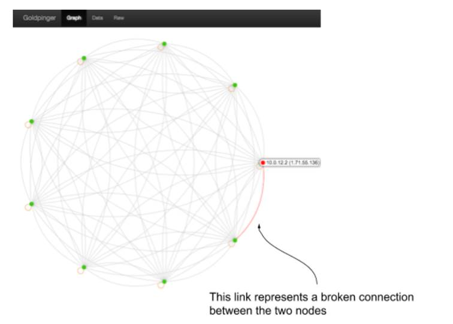

# 10.1 Porting things onto Kubernetes
“It’s technically a promotion, and Kubernetes is really hot right now, so that’s going to be great for your career! So you’re in, right?” said Alice as she walked out of the room. As the door closed, it finally hit you, that even though what she said was phrased as a question, in her mind, there wasn’t much uncertainty about the outcome: You must save that High-Profile Project, period.

The project was weird from the beginning. The upper management announced it to a lot of fanfare and red-ribbon-cutting, but it was never made quite clear what function it was supposed to serve.--apart from “solving a lot of problems” by doing things like “getting rid of the monolith” and leveraging “the power of microservices” and the “amazing features of Kubernetes.” And - as if this wasn’t mysterious enough - the previous technical lead of the team just left the company. He really left. The last time someone was in contact with him, he was on his way to the Himalayas to start a new life as a llama breeder.

Truth be told, you are the person for this job. People know you’re into chaos engineering, and they heard about the problems you uncovered with your experiments. If anyone can pick up where the llama-breeder-to-be left off and turn it into a reliable system, it’s you! You just need to learn how this entire Kubernetes thing works, what the High-Profile project is supposed to do, and then come up with a plan of attack. Lucky for you, this chapter will teach you exactly that. What a coincidence! Also, the documentation you inherited reveals some useful details. Let’s take a look at it.

## 10.1.1 High-profile project documentation
There isn’t much documentation for the High-Profile Project, so I’ll just paste it verbatim for you to get the full experience. Turns out that, rather suitably, the project is called ICANT. Here’s how the document describes this acronym:

`ICANT` - International, Crypto-fueled, AI-powered, Next-generation market Tracking

A little cryptic, isn’t it? It’s almost like someone designed it to be confusing to raise more funds. Something to do with AI and cryptocurrencies. But wait, there is a mission statement too, maybe this clears things up a little bit:

```shell
Build a massively-scalable, distributed system for tracking cryptocurrency flows with cutting-edge AI for technologically advanced clients all over the world.
```

No, not really; that doesn’t help much. Fortunately there is more. The section on current status reveals that we don’t need to worry about the AI, crypto or market stuff - that’s all on the TODO list. This is what it says:

```shell
Current status: first we approached the “distributed” part. We’re running Kubernetes, so we set up Goldpinger that makes connections between all the nodes to simulate the crypto traffic.
TODO: the AI stuff, the crypto stuff and markets stuff
```

All of a sudden, starting a new life in the Himalayas makes much more sense! They took a network diagnostic tool Goldpinger (https://github.com/bloomberg/goldpinger - by yours truly), deployed it on their Kubernetes cluster, put all the actual work in the TODO, and left the company. And now it’s your problem!

What does Goldpinger actually do? It produces a full graph of Kubertnetes cluster connectivity by calling all instances of itself, measuring the times and producing reports based on that data. Typically one runs an instance of Goldpinger per node in their cluster to detect any networking issues across nodes. See figure 10.1 for an example of what a graph like that looks like with a single node having connectivity issues. The Goldpinger UI uses colors (green for OK, red for trouble), and I marked the affected link in the screenshot.

Figure 10.1 Goldpinger graph showing connectivity between nodes in a Kubernetes cluster



For any crypto-AI-market-tracking enthusiast this is going to be an anti-climax. But from our point of view, it makes the job easier: we have a single component to work with that doesn’t require any buzzwords knowledge. We can do it. First stop - a quick intro to Kubernetes. Start your stopwatch.