# 10.4 Testing out software running on Kubernetes
With a functional Kubernetes cluster at our disposal, we’re now ready to start working on the High Profile Project, aka ICANT. The pressure is on, we have a project to save!

As always, the first step is to build an understanding of how things work before we can reason about how they break. We’ll do that by kicking the tires and looking how ICANT is deployed and configured. Once we’re done with that, we’ll conduct two experiments and then finish this section by seeing how to make things easier for ourselves for the next time. Let’s start at the beginning - by running the actual project

## 10.4.1 Running the ICANT Project
As we discovered earlier when reading the documentation you inherited, the project didn’t get very far. They took an off-the-shelf component (Goldpinger), deployed it, and called it a day. All of which is bad news for the project, but good news to me; I have less explaining to do!

Goldpinger works by querying Kubernetes for all the instances of itself, and then periodically calling each of these instances and measuring the response time. It then uses that data to generate statistics (metrics) and plot a pretty connectivity graph. Each instance works in the same way - it periodically gets the address of its peers, and makes a request to each one of them. This is illustrated in figure 10.4. Goldpinger was invented to detect network slow-downs and problems, especially in larger clusters. It’s really simple and very effective.

Figure 10.4 Overview of how Goldpinger works

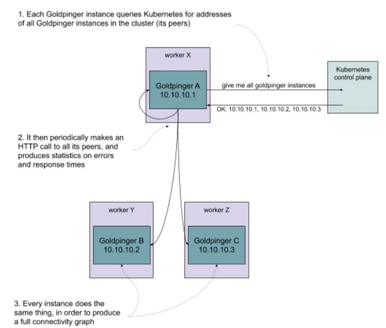

How do we go about running it? We’ll do it in two steps:

1. Set up the right permissions, so that Goldpinger can query Kubernetes for its peer
2. Deploy it on the cluster

We’re about to step into Kubernetes Wonderland, so let me introduce you to some Kubernetes lingo.

### Kubernetes terminology
The documentation often mentions resources to mean the objects representing various abstractions that Kubernetes offers. For now, I’m going to introduce you to three basic building blocks used to describe software on Kubernetes:

* Pod. A pod is a collection of containers that are grouped together, run on the same host and share some system resources, for example an IP address. This is the unit of software that you can schedule on Kubernetes. You can schedule pods directly, but most of the time you will be using a higher level abstraction, such as a Deployment.
* Deployment. A deployment describes a blueprint for creating pods, along with extra metadata, like for example the number of replicas to run. Importantly, it also manages the lifecycle of pods that it creates. For example, if you modify a deployment to update a version of the image you want to run, the deployment can handle a rollout, deleting old pods and creating new ones one by one to avoid an outage. It also offers other things, like roll-back, if the roll out ever fails.
* Service. A service matches an arbitrary set of pods, and provides a single IP address that resolves to the matched pods. That IP is kept up to date with the changes made to the cluster. For example, if a pod goes down, it will be taken out of the pool.

You can see a visual representation of how these fit together in figure 10.5.

Figure 10.5 Pods, deployments and services example in Kubernetes

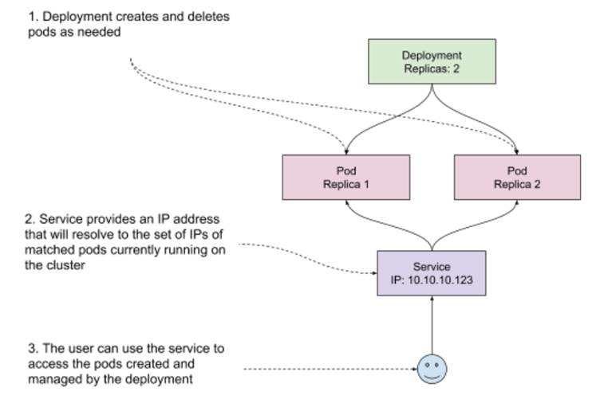

Another thing you need to know to understand how Goldpinger works is that to query Kubernetes, you need to have the right permissions.


**NOTE POP QUIZ: WHAT’S A KUBERNETES DEPLOYMENT?**

Pick one:

1. A description of how to reach software running on your cluster
2. A description of how to deploy some software on your cluster
3. A description of how to build a container

See appendix B for answers.



### Permissions
Kubernetes has an elegant way of managing permissions. First, it has a concept of a ClusterRole, that allows you to define a role and a corresponding set of permissions to execute verbs (create, get, delete, list, …) on various resources. Second, it has the concept of ServiceAccounts, which can be linked to any software running on Kubernetes, so that it inherits all the permissions that the ServiceAccount was granted. And finally, to make a link between a ServiceAccount and a ClusterRole, you can use a ClusterRoleBinding, which does exactly what it says on the tin.

If you’re new to it, this permissioning might sound a little bit abstract, so take a look at figure 10.6 for a graphical representation of how all of this comes together.

Figure 10.6 Kubernetes permissioning example

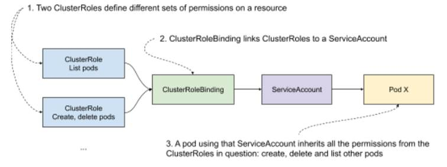

In our case, we want to allow Goldpinger pods to list its peers, so all we need is a single ClusterRole, and the corresponding ServiceAccount and ClusterRoleBinding. Later, we will use that ServiceAccount to permission the Goldpinger pods.

### Creating the resources
Time for some code! In Kubernetes, we can describe all resources we want to create using a Yaml file (.yml; https://yaml.org/) that follows the specific format that Kubernetes accepts. See listing 10.1 to see how all of this permissioning translates into .yml. For each element we described, there is a Yaml object, specifying the corresponding type (kind) and the expected parameters. First, a ClusterRole called `goldpinger-clusterrol` that allows for listing pods (bold font). Then a ServiceAccount called `goldpinger-serviceaccount` (bold font). And finally, a ClusterRoleBinding, linking the ClusterRole to the ServiceAccount. If you’re new to Yaml, note that the `---` separators allow for describing multiple resources in a single file.

```yaml
Listing 10.1 goldpinger-rbac.yaml
---
apiVersion: rbac.authorization.k8s.io/v1
kind: ClusterRole                              #A
metadata:
  name: goldpinger-clusterrole
rules:
- apiGroups:
  - ""
  resources:
  - pods                                       #B
  verbs:
  - list                                       #C
---
apiVersion: v1
kind: ServiceAccount                           #D
metadata:
  name: goldpinger-serviceaccount
  namespace: default
---
apiVersion: rbac.authorization.k8s.io/v1beta1
kind: ClusterRoleBinding
metadata:
  name: goldpinger-clusterrolebinding
roleRef:
  apiGroup: rbac.authorization.k8s.io
  kind: ClusterRole
  name: goldpinger-clusterrole                 #E
subjects:
  - kind: ServiceAccount
    name: goldpinger-serviceaccount            #F
    namespace: default
```

\#A we start with a cluster role

\#B the cluster role gets permissions for resource of type pod

\#C the cluster role gets permissions to list the resource of type pod

\#D we create a service account to use later

\#E we create a cluster role binding, that binds the cluster role...

\#F … to the service account

This takes care of the permissionsing part. Let’s now go ahead and see what deploying the actual Goldpinger looks like.

### Goldpinger .yml files
To make sense of deploying Goldpinger, I need to explain one more detail that I skipped over so far: matching and labels.

Kubernetes makes extensive use of labels, which are simple key-value pairs of type string. Every resource can have arbitrary metadata attached to it, including labels. They are used by Kubernetes to match sets of resources, and are fairly flexible and easy to use.

For example, let’s say that you have two pods, with the following labels:

1. Pod A, with labels `app=goldpinger` and `stage=dev`
2. Pod B, with labels `app=goldpinger` and `stage=prod`

If you match (select) all pods with label `app=goldpinger`, you will get both pods. But if you match with label `stage=dev`, you will only get pod A. You can also query by multiple labels, and in that case Kubernetes will return pods matching all requested labels (a logical AND).

Labels are useful for manually grouping resources, but they’re also leveraged by Kubernetes, for example to implement deployments. When you create a deployment, you need to specify the selector (a set of labels to match), and that selector needs to match the pods created by the deployment. The connection between the deployment and the pods it manages relies on labels.

Label-matching is also the same mechanism that Goldpinger leverages to query for its peers: it just asks Kubernetes for all pods with a specific label (by default `app=goldpinger`). Figure 10.7 shows that graphically.

Figure 10.7 Kubernetes permissioning example

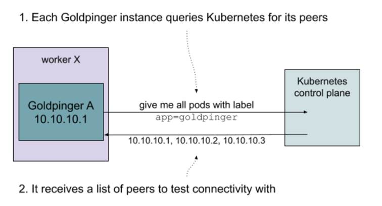

Putting this all together, we can finally write a .yml file with two resource descriptors: a deployment and a matching service.

Inside the deployment, we need to specify the following:

* The number of replicas (we’ll go with three for demonstration purposes)
* The selector (again the default app=goldpinger),
* The actual template of pods to create

In the pod template, we will specify the container image to run, some environment values required for Goldpinger to work and ports to expose so that other instances can reach it. The important bit is that we need to specify some arbitrary port that matches the `PORT` environment variable (this is what Goldpinger uses to know what port to listen on). We’ll go with 8080. Finally, we also specify the service account we created earlier on, to permission the Goldpinger pods to query Kubernetes for their peers.

Inside the service, we once again use the same selector (`app=goldpinger`), so that the service matches the pods created by the deployment, and the same port 8080 that we specified on the deployment.


**NOTE DEPLOYMENTS AND DAEMONSETS**

In a typical installation, we would like to have one Goldpinger pod per node (physical machine, VM) in your cluster. That can be easily achieved by using a DaemonSet (it works a lot like a deployment, but instead of specifying the number of replicas, it just assumes one replica per node - learn more at https://kubernetes.io/docs/concepts/workloads/controllers/daemonset/). In our example setup we will use a Deployment instead, because with only one node, we would only have a single pod of Goldpinger, which defeats the purpose of this demonstration.


Listing 10.2 contains the .yml file we can use to create the deployment and the service. Take a look.

```yaml
Listing 10.2 goldpinger.yml .
---
apiVersion: apps/v1
kind: Deployment
metadata:
  name: goldpinger
  namespace: default
  labels:
    app: goldpinger
spec:
  replicas: 3                                                #A
  selector:                                                  #B
    matchLabels:
      app: goldpinger
  template:
    metadata:                                                #C
      labels:
        app: goldpinger
    spec:
      serviceAccount: "goldpinger-serviceaccount"
      containers:
      - name: goldpinger
        image: "docker.io/bloomberg/goldpinger:v3.0.0"
        env:
        - name: REFRESH_INTERVAL
          value: "2"
        - name: HOST
          value: "0.0.0.0"
        - name: PORT
          value: "8080"                                      #D
        # injecting real pod IP will make things easier to understand
        - name: POD_IP
          valueFrom:
            fieldRef:
              fieldPath: status.podIP
        ports:
        - containerPort: 8080                                #E
          name: http
---
apiVersion: v1
kind: Service
metadata:
  name: goldpinger
  namespace: default
  labels:
    app: goldpinger
spec:
  type: LoadBalancer
  ports:
    - port: 8080                                             #F
      name: http
  selector:
    app: goldpinger                                          #G
```

\#A the deployment will create three replicas of the pods (three pods)

\#B the deployment is configured to match pods with label app=goldpinger

\#C the pods template actually gets the label app=goldpinger

\#D we configure the Goldpinger pods to run on port 8080

\#E we expose the port 8080 on the pod, so that it’s reachable

\#F in the service, we target port 8080 that we made available on the pods

\#G the service will target pods based on the label app=goldpinger

With that, we’re now ready to actually start it! If you’re following along, you can find the source code for both of these files (`goldpinger-rbac.yml` and `goldpinger.yml`) at https://github.com/seeker89/chaos-engineering-book/tree/master/examples/kubernetes. Let’s make sure that both files are in the same folder, and let’s go ahead and run them.

### Deploying Goldpinger
```shell
Start by creating the permissioning resources (the goldpinger-rbac.yml file), by running the following command: 
   kubectl apply -f goldpinger-rbac.yml
```
You will see Kubernetes confirming the three resources were created successfully, with the following output:

```shell
clusterrole.rbac.authorization.k8s.io/goldpinger-clusterrole created 
  serviceaccount/goldpinger-serviceaccount created 
  clusterrolebinding.rbac.authorization.k8s.io/goldpinger-clusterrolebinding created
```

Then, create the actual deployment and a service by running the following command:

```shell
kubectl apply -f goldpinger.yml
```

Just like before, you will see the confirmation that the resources were created:

```shell
deployment.apps/goldpinger created
service/goldpinger created
```

Once that’s done, let’s confirm that pods are running as expected. To do that, list the pods by running the following command:

```shell
kubectl get pods
```

You should see an output similar to the following, with three pods in status `Running` (bold font). If they’re not, you might need to give it a few seconds to start:

```shell
NAME            READY   STATUS    RESTARTS   AGE
goldpinger-c86c78448-5kwpp   1/1     Running   0          1m4s
goldpinger-c86c78448-gtbvv   1/1     Running   0          1m4s
goldpinger-c86c78448-vcwx2   1/1     Running   0          1m4s
```

The pods are running, meaning that the deployment did its job. Goldpinger crashes if it can’t list its peers, which means that the permissioning we set up also works as expected. The last thing to check, is that the service was configured correctly. You can do that by running the following command, specifying the name of the service we created (“goldpinger”):

```shell
kubectl describe svc goldpinger
```

You will see the details of the service, just like in the following output (abbreviated). Note the Endpoints field, specifying three IP addresses, for the three pods that it’s configured to match.

```shell
Name:        goldpinger
Namespace:                default
Labels:      app=goldpinger
(...)
Endpoints:                172.17.0.3:8080,172.17.0.4:8080,172.17.0.5:8080
(...)
```

If you want to be 100% sure that the IPs are correct, you can compare them to the IPs of Goldpinger pods. You can display them easily, by appending `-o wide` (for wide output) to the kubectl get pods command. Try it by running the following:

```shell
kubectl get pods -o wide
```

You will see the same list as before, but this time with extra details, including the IP (bold font). They should correspond to the list specified in the service. If they weren’t, it would point to misconfigured labels. Note, that depending on your internet connection speed and your setup, it might take a little bit of time to start. If you see pods in pending state, give it an extra minute:

```shell
NAME            READY   STATUS    RESTARTS   AGE   IP           NODE       NOMINATED NODE   READINESS GATES
goldpinger-c86c78448-5kwpp   1/1     Running   0          15m   172.17.0.4   minikube   <none>           <none>
goldpinger-c86c78448-gtbvv   1/1     Running   0          15m   172.17.0.3   minikube   <none>           <none>
goldpinger-c86c78448-vcwx2   1/1     Running   0          15m   172.17.0.5   minikube   <none>           <none>
```

Everything's up and running, so let’s access Goldpinger to see what it’s really doing. To do that, we’ll need to access the service we created.


**NOTE ACCESSING THE SOFTWARE RUNNING ON KUBERNETES FROM OUTSIDE THE CLUSTER**

Kubernetes does a great job standardizing the way people run their software. Unfortunately, not everything is easily standardized. Although every Kubernetes cluster supports services, the way you access the cluster and therefore its services depends on the way the cluster was set up. In this chapter, we will stick to Minikube, because it’s simple and easily accessible to anyone. If you’re running your own Kubernetes cluster, or use a managed solution from one of the cloud providers, accessing software running on the cluster might involve some extra setup (for example setting up an Ingress https://kubernetes.io/docs/concepts/services-networking/ingress/). Refer to the relevant documentation.


On Minikube, we can leverage the command `minikube service`, which will figure out a way to access the service directly from your host machine and open the browser for you. To do that, run the following command:

```shell
minikube service goldpinger
```

You will see an output similar to the following, specifying the special URL that Minikube prepared for you (bold font). Your default browser will be launched to open that URL.

```shell
|-----------|------------|-------------|-----------------------------|
| NAMESPACE |    NAME    | TARGET PORT |             URL             |
|-----------|------------|-------------|-----------------------------|
| default   | goldpinger | http/8080   | http://192.168.99.100:30426 |
|-----------|------------|-------------|-----------------------------|
🎉  Opening service default/goldpinger in default browser…
```

Inside the newly launched browser window, you will see the Goldpinger UI. It will look similar to what’s shown in figure 10.8. It’s a graph, on which every point represents an instance of Goldpinger, and every arrow represents the last connectivity check (an HTTP request) between the instances. You can click a node to select it and display extra information. It also provides other functionality like a heatmap, showing hotspots of any potential networking slowness; and metrics, providing statistics that can be used to generate alerts and pretty dashboards. Goldpinger is a really handy tool for detecting any network issues, downloaded more than a million times from Docker Hub!

Figure 10.8 Goldpinger UI in action

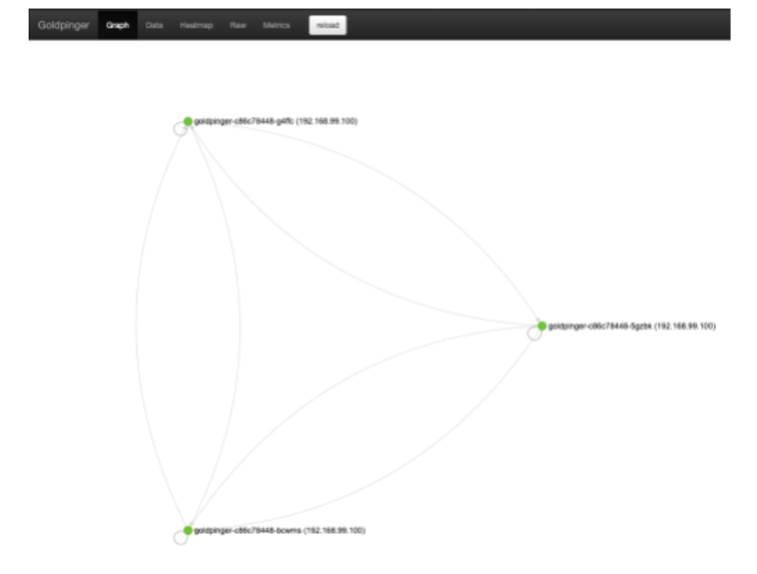

Feel free to take some time to play around, but otherwise we’re done setting it all up. We have a running application that we can interact with, all deployed with just two kubectl commands.

Unfortunately, on our little test cluster, all three instances are running on the same host, so we’re unlikely to see any network slowness, which is pretty boring. Fortunately, as chaos engineering practitioners, we’re well equipped to introduce failure and make things interesting again. Let’s start with the basics - an experiment to kill some pods.

## 10.4.2 Experiment 1: kill 50% of pods
Much like a villain from a comic book movie, we might be interested in seeing what happens when we kill 50% of Goldpinger pods. Why do that? It’s an inexpensive experiment that can answer a lot of questions about what happens when one of these instances goes down (simulating a machine going down). For example:

* Do the other instances detect that to begin with?
* If so, how long before they detect it?
* How does Goldpinger configuration affect all of that?
* If we had an alert set up, would it get triggered?

How should we go about implementing this? In the previous chapters, we’ve covered different ways this could be addressed. For example, you could log into the machine running the Goldpinger process you want to kill, and simply run a kill command, like we did before. Or, if your cluster uses Docker to run the containers (more on that soon), you could leverage the tools we’ve covered in chapter 5. The point is that all of the techniques you learned in the previous chapter still apply. That said, Kubernetes gives us other options, like directly deleting pods. It’s definitely the most convenient way of achieving that, so let’s go with that option.

There is another crucial detail to our experiment: Goldpinger works by periodically making HTTP requests to all of its peers. That period is controlled by the environment variable called `REFRESH_PERIOD`. In the goldpinger.yml file you deployed, that value was set to 2 seconds:

```shell
name: REFRESH_INTERVAL 
  value: "2"
```

That means that the maximum time it takes for an instance to notice another instance being down is 2 seconds. This is pretty aggressive and in a large cluster would result in a lot of traffic and CPU time spent on this, but I chose that value for our demonstration purposes. It will be handy to see the changes detected quickly. With that, we now have all the elements, so let’s turn this into a concrete plan of an experiment.

### Experiment 1: plan
If we take the first question we mentioned (do other Goldpinger instances detect a peer down), we can design a simple experiment plan like so:

1. Observability: use Goldpinger UI to see if there are any pods marked as inaccessible; use kubectl to see new pods come and go
2. Steady state: all nodes healthy
3. Hypothesis: if we delete one pod, we should see it in marked as failed in Goldpinger UI, and then be replaced by a new, healthy pod
4. Run the experiment

That’s it! Let’s see how to implement it.

### Experiment 1: implementation
To implement this experiment, the pod labels come in useful once again. All we need to do is leverage `kubectl get pods` to get all pods with label `app=goldpinger`, pick a random pod and kill it, using `kubectl delete`. To make things easy, we can also leverage kubectl’s -o name flag to only display the pod names, and use a combination of `sort --random-sort` and `head -n1` to pick a random line of the output. Put all of this together, and you get a script like `kube-thanos.sh` from listing 10.3. Store it somewhere on your system (or clone it from the Github repo).

```shell
Listing 10.3 kube-thanos.sh
#!/bin/bash
 
kubectl get pods \                #A
  -l app=goldpinger \             #B
  -o name \                       #C
    | sort --random-sort \        #D
    | head -n 1 \                 #E
    | xargs kubectl delete        #F
```

\#A use kubectl to list pods

\#B only list pods with label app=goldpinger

\#C only display the name as the output

\#D sort in random order

\#E pick the first one

\#F delete the pod

Armed with that, we’re ready to rock. Let’s run the experiment.

### Experiment 1: run!

Let’s start by double-checking the steady state. Your Goldpinger installation should still be running and you should have the UI open in a browser window. If it’s not, you can bring both back up by running the following commands:

```shell
kubectl apply -f goldpinger-rbac.yml 
  kubectl apply -f goldpinger.yml 
  minikube service goldpinger
```

To confirm all nodes are OK, simply refresh the graph by clicking the “reload” button, and verify that all three nodes are showing in green. So far so good.

To confirm that our script works, let’s also set up some observability for the pods being deleted and created. We can leverage the `--watch` flag of the `kubectl get` command to print the names of all pods coming and going to the console. You can do that by opening a new terminal window, and running the following command:

```shell
kubectl get pods --watch
```

You will see the familiar output, showing all the Goldpinger pods, but this time the command will stay active, blocking the terminal. You can use Ctrl-C to exit at any time, if needed.

```shell
NAME            READY   STATUS    RESTARTS   AGE 
goldpinger-c86c78448-6rtw4   1/1     Running   0          20h 
goldpinger-c86c78448-mj76q   1/1     Running   0          19h 
goldpinger-c86c78448-xbj7s   1/1     Running   0          19h
```

Now, to the fun part! To conduct our experiment, we’ll open another terminal window for the `kube-thanos.sh` script, run it to kill a random pod, and then quickly go to the Goldpinger UI to observe what the Goldpinger pods saw. Bear in mind that in the local setup, the pods will recover very rapidly, so you might need to be quick to actually observe the pod becoming unavailable and then healing. In the meantime, the `kubectl get pods --watch` command will record the pod going down and a replacement coming up. Let’s do that!

Open a new terminal window and run the script to kill a random pod:

```shell
bash kube-thanos.sh
```

You will see an output showing the name of the pod being deleted, like in the following:

```shell
pod "goldpinger-c86c78448-shtdq" deleted
```

Go quickly to the Goldpinger UI and click refresh. You should see some failure, like in figure 10.9. Nodes that can’t be reached by at least one other node will be marked as unhealthy. I marked the unhealthy node in the figure. The live UI also uses a red color to differentiate them. You will also notice that there are four nodes showing up. This is because after the pod is deleted, Kubernetes tries to recoverge to the desired state (three replicas), so it creates a new pod to replace the one we deleted.


**NOTE BE QUICK!**

If you’re not seeing any errors, the pods probably recovered before you switched to the UI window, because your computer is quicker than mine when I was writing this and chose the parameters. If you re-run the command and refresh the UI more quickly, you should be able to see it.


Figure 10.9 Goldpinger UI showing an unavailable pod being replaced by a new one

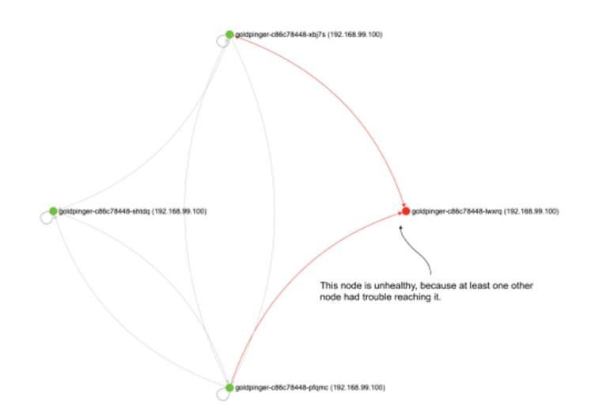

Now, go back to the terminal window that is running `kubectl get pods --watch`. You will see an output similar to the following. Note the pod that we killed (`-shtdq`) going into Terminating state, and a new pod (`-lwxrq`) taking its place (both in bold font). You will also notice that the new pod goes through a lifecycle of Pending to ContainerCreating to Running, while the old one goes to Terminating.

```shell
NAME            READY   STATUS    RESTARTS   AGE 
goldpinger-c86c78448-pfqmc   1/1     Running   0          47s 
goldpinger-c86c78448-shtdq   1/1     Running   0          22s 
goldpinger-c86c78448-xbj7s   1/1     Running   0          20h 
goldpinger-c86c78448-shtdq   1/1     Terminating   0          38s 
goldpinger-c86c78448-lwxrq   0/1     Pending       0          0s 
goldpinger-c86c78448-lwxrq   0/1     Pending       0          0s 
goldpinger-c86c78448-lwxrq   0/1     ContainerCreating   0          0s 
goldpinger-c86c78448-shtdq   0/1     Terminating         0          39s 
goldpinger-c86c78448-lwxrq   1/1     Running             0          2s 
goldpinger-c86c78448-shtdq   0/1     Terminating         0          43s 
goldpinger-c86c78448-shtdq   0/1     Terminating         0          43s
```

Finally, let’s check that everything recovered smoothly. To do that, go back to the browser window with Goldpinger UI, and refresh once more. You should now see the three new pods happily pinging each other, all in green. Which means that our hypothesis was correct, on both fronts.

Nice job. Another one bites the dust, another experiment under your belt. But before we move on, let’s just discuss a few points.


**NOTE POP QUIZ: WHAT HAPPENS WHEN A POD DIES ON A KUBERNETES CLUSTER?**

Pick one:

1. Kubernetes detects it and send you an alert
2. Kubernetes detects it, and will restart it as necessary to make sure the expected number of replicas are running
3. Nothing

See appendix B for answers.


### Experiment 1: discussion
For the sake of teaching, I took a few shortcuts here that I want to make you aware of. First, when accessing the pods through the UI, we’re using a service, which resolves to a pseudo-random instance of Goldpinger every time you make a new call. That means that it’s possible to get routed to the instance we just killed, and get an error in the UI. It also means that every time you refresh the view, you get the reality from a point of view of a different pod. For illustration purposes, that’s not a deal-breaker on a small test cluster but if you run a large cluster and want to make sure that a network partition doesn’t obscure your view, you will need to make sure you consult all available instances, or at least a reasonable subset. Goldpinger addresses that issue with metrics, and you can learn more about that at https://github.com/bloomberg/goldpinger#prometheus

Second, using a GUI-based tool this way is a little bit awkward. If you see what you expect, that’s great. But if you don’t, it doesn’t necessarily mean it didn’t happen, it might be that you simply missed it. Again, this can be alleviated by using the metrics, which I skipped here for the sake of simplicity.

Third, if you look closely at the failures that you see in the graph, you will see that the pods sometimes start receiving traffic before they are actually up. This is because, again for simplicity, I skipped the readiness probe that serves exactly that purpose. If set, a readiness probe prevents a pod from receiving any traffic until a certain condition is met (see the documentation at https://kubernetes.io/docs/tasks/configure-pod-container/configure-liveness-readiness-startup-probes/). For an example of how to use it, see the installation docs of Goldpinger (https://github.com/bloomberg/goldpinger#installation).

Finally, remember that depending on the refresh period you’re running Goldpinger with, the data you’re looking at is up to that many seconds stale, which means that for the pods we killed, we’ll keep seeing them for an extra number of seconds equal to the refresh period (2 seconds in our setup).

These are the caveats my lawyers advised me to clarify before this goes to print. In case that makes you think I’m not fun at parties, let me prove you wrong. Let’s play some Invaders, like it’s 1978.

## 10.4.3 Party trick: killing pods in style
If you really want to make a point that chaos engineering is fun, I’ve got two tools for you.

First, KubeInvaders (https://github.com/lucky-sideburn/KubeInvaders). It gamifies the process of killing pods by starting a clone of Space Invaders, where the aliens are pods in the specified namespace. You guessed it, the ones you shoot down are deleted in Kubernetes. Installation involves deploying it on a cluster, and then connecting a local client that actually displays the game content. See figure 10.10 to see what it looks like in action.

Figure 10.10 Kubeinvader screenshot from https://github.com/lucky-sideburn/KubeInvaders

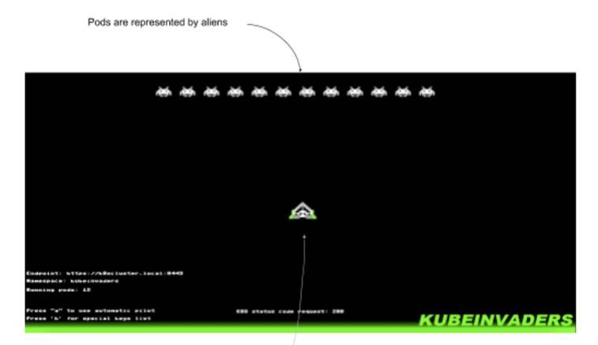

The second one is for fans of the first-person shooter genre: Kube DOOM (https://github.com/storax/kubedoom). Similar to KubeInvaders, it represents pods as enemies, and kills in Kubernetes the ones that die in the game. Tip to justify using it: it’s often much quicker than copying and pasting a name of a pod, saving so much time (mandatory reference: https://xkcd.com/303/). See figure 10.11 for a screenshot.

Figure 10.11 Kube DOOM screenshot from https://github.com/storax/kubedoom

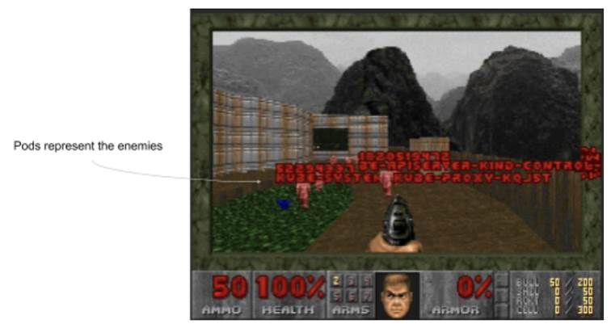

For Kube DOOM, the installation is pretty straightforward: you run a pod on the host, pass a kubectl configuration file to it, and then use a desktop sharing client to connect to the game. After a long day of debugging, it might be just what you need. I’ll just leave it there.

I’m sure that will help with your next house party. When you finish the game, let’s take a look at another experiment - some good old network slowness.

## 10.4.4 Experiment 2: network slowness
Slowness, my nemesis, we meet again. If you’re a software engineer, chances are you’re spending a lot of your time trying to outwit slowness. When things go wrong, actual failure is often easier to debug than situations when things mostly work. And slowness tends to fall into the latter category.

Slowness is such an important topic that we touch upon it in nearly every chapter of this book. We introduced some slowness using `tc` in chapter 4, and then again using Pumba in Docker in chapter 5. We use some in the context of JVM, application level ,and even browser in other chapters. Time to take a look at what’s different when running on Kubernetes.

It’s worth mentioning that everything we covered before still applies here. We could very well use `tc` or Pumba directly on one of the machines running the processes we’re interested in, and modify them to introduce the failure we care about. In fact, using `kubectl cp` and `kubectl exec`, we could upload and execute tc commands directly in a pod, without even worrying about accessing the host. Or we could even add a second container to the Goldpinger pod that would execute the necessary `tc` commands.

All of these options are viable, but share one downside: they modify the existing software that’s running on your cluster, and so by definition carry risks of messing things up. A convenient alternative is to add extra software, tweaked to implement the failure we care about, but otherwise identical to the original and introduce the extra software in a way that will integrate with the rest of the system. Kubernetes makes it really easy. Let me show you what I mean; let’s design an experiment around simulated network slowness.

### Experiment 2: plan
Let’s say that we want to see what happens when one instance of Goldpinger is slow to respond to queries of its peers. After all, this is what this piece of software was designed to help with, so before we rely on it, we should test that it works as expected.

A convenient way of doing that is to deploy a copy of Goldpinger that we can modify to add a delay. Once again, we could do it with `tc`, but to show you some new tools, let’s use a standalone network proxy instead. That proxy will sit in front of that new Goldpinger instance, receive the calls from its peers, add the delay, and relay the calls to Goldpinger. Thanks to Kubernetes, setting it all up is pretty straightforward.

Let’s iron out some details. Goldpinger’s default timeout for all calls is 300ms, so let’s pick an arbitrary value of 250ms for our delay: enough to be clearly seen, but not enough to cause a timeout. And thanks to the built-in heatmap, we will be able to visually show the connections that take longer than others, so the observability aspect is taken care of. The plan of the experiment figuratively writes itself:

1. Observability: use Goldpinger UI to read delays using the graph UI and the heatmap
2. Steady state: all existing Goldpinger instantes report healthy
3. Hypothesis: if we add a new instance that has a 250ms delay, the connectivity graph will show all four instances healthy, and the 250ms delay will be visible in the heatmap
4. Run the experiment!

Sounds good? Let’s see how to implement it.

### Experiment 2: implementation
Time to dig into what the implementation will look like. Do you remember figure 10.4 that showed how Goldpinger worked? Let me copy it for your convenience in figure 10.12. Every instance asks Kubernetes for all its peers, and then periodically makes calls to them to measure latency and detect problems.

Figure 10.12 Overview of how Goldpinger works (again)

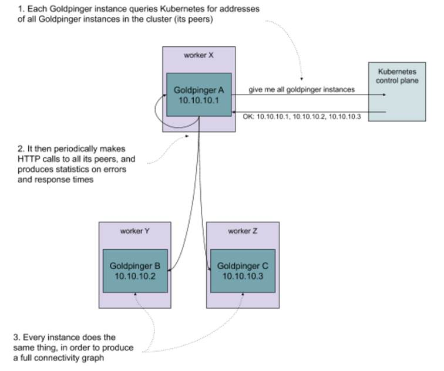

Now, what we want to do is add a copy of the Goldpinger pod that has the extra proxy we just discussed in front of it. A pod in Kubernetes can have multiple containers running alongside each other and able to communicate via localhost. If we use the same label `app=goldpinger`, the other instances will detect the new pod and start calling. But we will configure the ports in a way that instead of directly reaching the new instance, the peers will first reach the proxy (in port 8080). And the proxy will add the desired latency. The extra Goldpinger instance will be able to ping the other hosts freely, like a regular instance. This is summarized in figure 10.13.

Figure 10.13 A modified copy of Goldpinger with an extra proxy in front of it

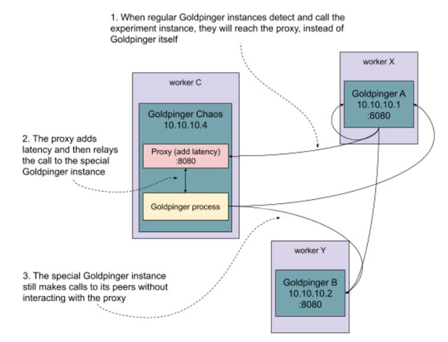

We’ve got the idea of what the setup will look like, now we need the actual networking proxy. Goldpinger communicates via HTTP/1.1, so we’re in luck. It’s a text-based, reasonably simple protocol running on top of TCP. All we need is the protocol specification (RFC 7230[^1], RFC 7231[^2], RFC 7232[^3], RFC 7233[^4] and RFC 7234[^5]) and we should be able to implement a quick proxy in no time. Dust off your C compiler, stretch your arms, and let’s do it!

### Experiment 2: Toxiproxy
Just kidding! We’ll use an existing, open-source project designed for this kind of thing, called Toxiproxy (https://github.com/shopify/toxiproxy). It works as a proxy on TCP level (L4 OSI model), which is fine for us, because we don’t actually need to understand anything about what’s going on on the HTTP level (L7) to introduce a simple latency. The added benefit is that you can use the same tool for any other TCP-based protocol in the exact same way, so what we’re about to do will be equally applicable to a lot of other popular software, like Redis, MySQL, PostgreSQL and many more.

ToxiProxy consists of two pieces:

* the actual proxy server, which exposes an API you can use to configure what should be proxied where and the kind of failure that you expect
* and a CLI client, that connects to that API and can change the configuration live


**NOTE CLI AND API**

Instead of using the CLI, you can also talk to the API directly, and ToxiProxy offers ready-to-use clients in a variety of languages.


The dynamic nature of ToxiProxy makes it really useful when used in unit and integration testing. For example, your integration test could start by configuring the proxy to add latency when connecting to a database, and then your test could verify that timeouts are triggered accordingly. It’s also going to be handy for us in implementing our experiment.

The version we’ll use, 2.1.4 (https://github.com/Shopify/toxiproxy/releases/tag/v2.1.4), is the latest available release at the time of writing. We’re going to run the proxy server as part of the extra Goldpinger pod using a prebuilt, publicly available image from Docker Hub. We’ll also need to use the CLI locally on your machine. To install it, download the CLI executable for your system (Ubuntu/Debian, Windows, MacOS) from https://github.com/Shopify/toxiproxy/releases/tag/v2.1.4 and add it to your PATH. To confirm it works, run the following command:

```
toxiproxy-cli –version
```

You should see the version 2.1.4 displayed, like in the following output:

```
toxiproxy-cli version 2.1.4
```

When a ToxiProxy server starts, by default it doesn’t do anything apart from running its HTTP API. By calling the API, you can configure and dynamically change the behavior of the proxy server. You can define arbitrary configurations defined by:

1. a unique name
2. a host and port to bind to and listen for connections
3. a destination server to proxy to

For every configuration like this, you can attach failures. In ToxiProxy lingo, these failures are called “toxics”. Currently, the following toxics are available:

1. latency - add arbitrary latency to the connection (in either direction)
2. down - take the connection down
3. bandwidth - throttle the connection to the desired speed
4. slow close - delay the TCP socket from closing for an arbitrary time
5. timeout - wait for an arbitrary time and then close the connection
6. slicer - slices the received data into smaller bits before sending it to the destination

You can attach an arbitrary combination of failures to every proxy configuration you define. For our needs, the latency toxic will do exactly what we want it to. Let’s see how all of this fits together.


**NOTE POP QUIZ: WHAT’S TOXIPROXY?**

Pick one:

1. A configurable TCP proxy, that can simulate various problems, like dropped packets or network slowness
2. A K-pop band singing about the environmental consequences of dumping large amounts of toxic waste sent to third world countries through the use of proxy and shell companies

See appendix B for answers.


### Experiment 2: implementation continued
To sum it all up, we want to create a new pod with two containers: one for Goldpinger and one for the ToxiProxy. We’ll need to configure Goldpinger to run on a different port, so that the proxy can listen on the default port 8080 that the other Goldpinger instances will try to connect to. We’ll also create a service that routes connections to the proxy API on port 8474, so that we can use toxiproxy-cli commands to configure the proxy and add the latency that we want,just like in figure 10.14.

Figure 10.14 Interacting with the modified version of Goldpinger using toxiproxy-cli

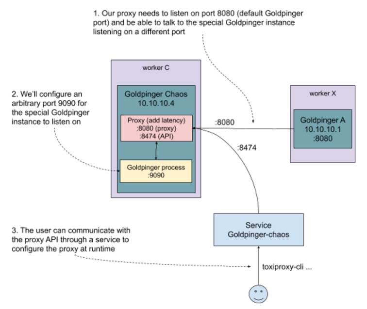

Let’s now translate this into a Kubernetes .yml file. You can see the resulting goldpinger-chaos.yml in listing 10.4. You will see two resource descriptions, a pod (with two containers) and a service. Note, that we use the same service account we created before, to give Goldpinger the same permissions. We’re also using two environment variables, `PORT` and `CLIENT_PORT_OVERRIDE`, to make Goldpinger listen on port 9090, but call its peers on port 8080, respectively. This is because by default, Goldpinger calls its peers on the same port that it runs itself. Finally, notice that the service is using a label `chaos=absolutely` to match to the new pod we created. It’s important that the Goldpinger pod has the label `app=goldpinger`, so that it can be found by its peers, but we also need another label to be able to route connections to the proxy API.

```yaml
---
apiVersion: v1
kind: Pod
metadata:
  name: goldpinger-chaos
  namespace: default
  labels:
    app: goldpinger                                #A
    chaos: absolutely
spec:
  serviceAccount: "goldpinger-serviceaccount"      #B
  containers:
  - name: goldpinger
    image: docker.io/bloomberg/goldpinger:v3.0.0
    env:
    - name: REFRESH_INTERVAL
      value: "2"
    - name: HOST
      value: "0.0.0.0"
    - name: PORT
      value: "9090"                               #C
    - name: CLIENT_PORT_OVERRIDE
      value: "8080"
    - name: POD_IP
      valueFrom:
        fieldRef:
          fieldPath: status.podIP
  - name: toxiproxy
    image: docker.io/shopify/toxiproxy:2.1.4
    ports:
    - containerPort: 8474                         #D
      name: toxiproxy-api
    - containerPort: 8080
      name: goldpinger
---
apiVersion: v1
kind: Service
metadata:
  name: goldpinger-chaos
  namespace: default
spec:
  type: LoadBalancer
  ports:
    - port: 8474                                  #E
      name: toxiproxy-api
  selector:
    chaos: absolutely                             #F
```

\#A the new pod has the same label app=goldpinger to be detected by its peers, but also chaos=absolutely to be matched by the proxy api service

\#B we use the same service account as other instances to give Goldpinger permission to list its peers

\#C we use HOST envvar to make Goldpinger listen on port 9090, and CLIENT_PORT_OVERRIDE to make it call itse peers on the default port 8080

\#D ToxiProxy container will expose two ports: 8474 with the ToxiProxy API and 8080 to proxy through to Goldpinger

\#E the service will route traffic to port 8474 (ToxiProxy API)

\#F the service will use label chaos=absolutely to select the pods running ToxiProxy

And that’s all we need. Make sure you have this file handy (or clone it from the repo like before). Ready to rock? Let the games begin!

### Experiment 2: run!
To run this experiment, we’re going to use the Goldpinger UI. If you closed the browser window before, restart it by running the following command in the terminal:

```
minikube service goldpinger
```

Let’s start with the steady state, and confirm that all three nodes are visible and report as healthy. In the top bar, click Heatmap. You will see a heatmap similar to the one in figure 10.15. Each square represents connectivity between nodes and is color-coded based on the time it took to execute a request.

* Columns represent source (from)
* Rows represent destinations (to)
* The legend clarifies which number corresponds to which pod.

In this example, all squares are the same color and shade, meaning that all requests took below 2ms, which is to be expected when all instances run on the same host. You can also tweak the values to your liking and click “refresh” to show a new heatmap. Close it when you’re ready.

Figure 10.15 Example of Goldpinger Heatmap

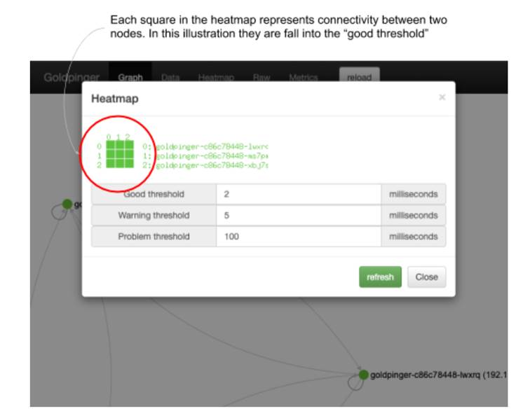

Let’s introduce our new pod! To do that, we’ll `kubectl apply` the goldpinger-chaos.yml file from listing 10.4. Run the following command:

```
kubectl apply -f goldpinger-chaos.yml
```

You will see an output confirming creation of a pod and service:

```
pod/goldpinger-chaos created
service/goldpinger-chaos created
```

Let’s confirm it’s running by going to the UI. You will now see an extra node, just like in figure 10.16. But notice that the new pod is marked as unhealthy - all of its peers are failing to connect to it. In the live UI, the node is marked in red, and in the figure 10.16 I annotated the new, unhealthy node for you. This is because we haven’t configured the proxy to pass the traffic yet.

Figure 10.16 Extra Goldpinger instance, detected by its peers, but inaccessible

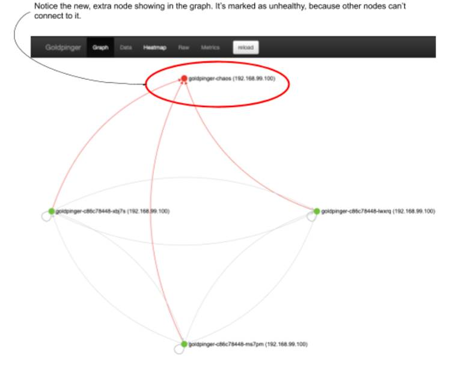

Let’s address that by configuring the ToxiProxy. This is where the extra service we deployed comes in handy: we will use it to connect to the ToxiProxy API using toxiproxy-cli. Do you remember how we used `minikube service` to get a special URL to access the Goldpinger service? We’ll leverage that again, but this time with the `--url` flag, to only print the url itself. Run the following command in a bash session to store the url in a variable:

```
TOXIPROXY_URL=$(minikube service --url goldpinger-chaos)
```

We can now use the variable to point toxiproxy-cli to the right ToxiProxy API. That’s done using the -h flag. Confusingly, -h is not for “help”, it’s for “host”. Let’s confirm it works by listing the existing proxy configuration:

```
toxiproxy-cli -h $TOXIPROXY_URL list
```

You will see the following output, saying there are no proxies configured. It even goes so far as to hint we create some proxies (bold font):

```
Name       Listen          Upstream                Enabled         Toxics
no proxies
 
Hint: create a proxy with `toxiproxy-cli create`
```

Let’s configure one. We’ll call it chaos, make it route to localhost:9090 (where we configured Goldpinger to listen to) and listen on 0.0.0.0:8080 to make it accessible to its peers to call. Run the following command to make that happen:

```
toxiproxy-cli \ 
  -h $TOXIPROXY_URL \        #A
  create chaos \             #B
  -l 0.0.0.0:8080 \          #C
  -u localhost:9090          #D
```

\#A connect to specific proxy

\#B create a new proxy configuration called “chaos”

\#C listen on 0.0.0.0:8080 (default Goldpinger port)

\#D relay connections to localhost:9090 (where we configured Goldpinger to run)

You will see a simple confirmation that the proxy was created:

```
Created new proxy chaos
```

Rerun the `toxiproxy-cli list` command to see the new proxy appear this time:

```
toxiproxy-cli -h $TOXIPROXY_URL list
```

You will see the following output, listing a new proxy configuration called “chaos” (bold font):

```
Name       Listen          Upstream                Enabled         Toxics 
  ================================================ 
  chaos      [::]:8080       localhost:9090          enabled         None 
  
Hint: inspect toxics with `toxiproxy-cli inspect <proxyName>`
```

If you go back to the UI and click refresh, you will see that the `goldpinger-chaos` extra instance is now green, and all instances happily report healthy state in all directions. If you check the heatmap, it will also show all green.

Let’s change that. Using the command `toxiproxy-cli toxic add`, let’s add a single toxic with 250ms latency. Do that by running the following command:

```
toxiproxy-cli \
-h $TOXIPROXY_URL \
toxic add \                  #A
--type latency \             #B
--a latency=250 \            #C
--upstream \                 #D
chaos                        #E
```

\#A add a toxic to an existing proxy configuration

\#B toxic type is latency

\#C we want to add 250ms of latency

\#D we set it in the upstream direction, towards the Goldpinger instance

\#E we attach this toxic to a proxy configuration called “chaos”

You will see a confirmation:

```
Added upstream latency toxic 'latency_upstream' on proxy 'chaos'
To confirm that the proxy got it right, we can inspect our proxy called “chaos”. To do that, run the following command:
toxiproxy-cli -h $TOXIPROXY_URL inspect chaos
```

You will see an output just like the following, listing our brand new toxic (bold font):

```
Name: chaos     Listen: [::]:8080       Upstream: localhost:9090 
  ====================================================================== 
  Upstream toxics: 
  latency_upstream:       type=latency    stream=upstream toxicity=1.00   attributes=[    jitter=0        latency=250     ] 
  
  Downstream toxics: 
  Proxy has no Downstream toxics enabled.
```

Now, go back to the Goldpinger UI in the browser and refresh. You will still see all four instances reporting healthy and happy (the 250ms delay fits within the default timeout of 300ms). But if you open the heatmap, this time it will tell a different story. The row with `goldpinger-chaos` pod will be marked in red (problem threshold), implying that all its peers detected slowness. See figure 10.17 for a screenshot.

Figure 10.17 Goldpinger heatmap, showing slowness accessing pod goldpinger-chaos

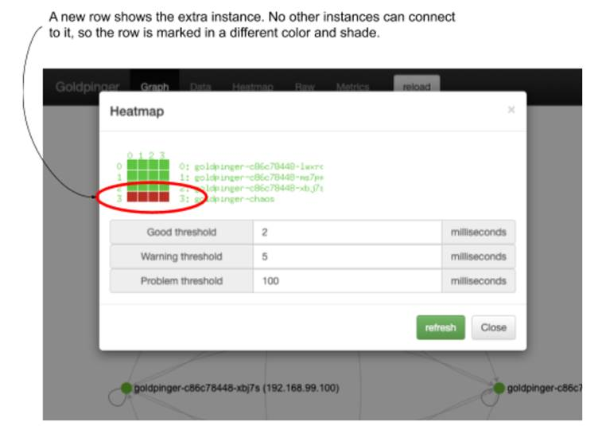

This means that our hypothesis was correct: Goldpinger correctly detects and reports the slowness, and at 250ms, below the default timeout of 300ms, the Goldpinger graph UI reports all as healthy. And we did all of that without modifying the existing pods.

This wraps up the experiment, but before we go, let’s clean up the extra pod. To do that, run the following command to delete everything we created using the goldpinger-chaos.yml file:

```
kubectl delete -f goldpinger-chaos.yml
```

Let’s discuss our findings.

### Experiment 2: Discussion
How well did we do? We took some time to learn new tools, but the entire implementation of the experiment boiled down to a single .yml file and a handful of commands with ToxiProxy. We also had a tangible benefit of working on a copy of the software that we wanted to test, leaving the existing running processes unmodified. We effectively rolled out some extra capacity and then had 25% of running software affected, limiting the blast radius. Does it mean we could do that in production? As with any sufficiently complex question, the answer is, “it depends.” In this example, if we wanted to verify the robustness of some alerting that relies on metrics from Goldpinger to trigger, this could be a good way to do it. But the extra software could also affect the existing instances in a more profound way, making it more risky. At the end of the day, it really depends on your application.

There is, of course, room for improvement. For example, the service we’re using to access the Goldpinger UI is routing traffic to any instance matched in a pseudo-random fashion. That means that sometimes it will route to the instance that has the 250ms delay. In our case, that will be difficult to spot with the naked eye, but if you wanted to test a larger delay, it could be a problem.

Time to wrap up this first part. Coming in part 2: making your chaos engineer life easier with PowerfulSeal.

---
[^1]: https://tools.ietf.org/html/rfc7230
[^2]: https://tools.ietf.org/html/rfc7231
[^3]: https://tools.ietf.org/html/rfc7232
[^4]: https://tools.ietf.org/html/rfc7233
[^5]: https://tools.ietf.org/html/rfc7234