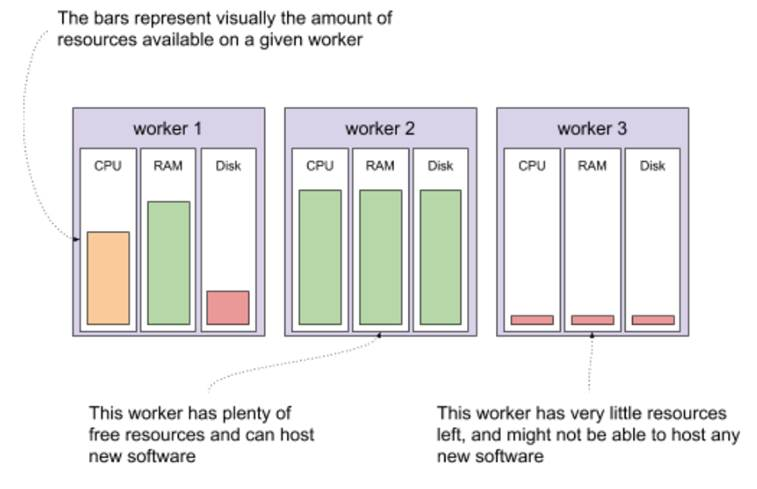
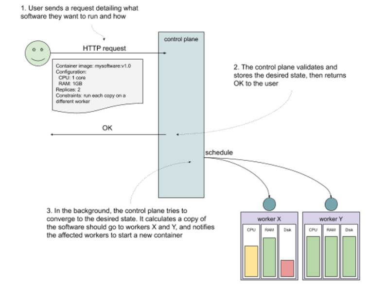

# 10.2 What’s Kubernetes (in 7 minutes)?
Kubernetes (often referred to as k8s for short) describes itself as “an open-source system for automating deployment, scaling, and management of containerized applications” (https://kubernetes.io/). That sounds great, but what does that really mean?

Let’s start simple. Let’s say you have a piece of software that you need to run on your computer. You can start your laptop, log in, and run the program. Congratulations, you just did a manual deployment of your software! So far so good.

Now, imagine that you need the same piece of software to run not on 1, but on 10 computers. All of a sudden, logging into 10 computers doesn’t sound so attractive, so you begin to think about automating that deployment. You could hack together a script that uses SSH to remotely log into the 10 computers and start your program. Or you could use one of the many existing configuration management tools, like Ansible (https://github.com/ansible/ansible) or Chef (https://www.chef.io/). With 10 computers to take care of, it might just work.

Unfortunately, it turns out that the program you started on these machines sometimes crashes. It might not even be a bug, but other problems, for example insufficient disk storage. So you need something to supervise the process, and try to bring it back up when it crashes. You could achieve that by making your configuration management tool configure a systemd service (https://www.freedesktop.org/software/systemd/man/systemd.service.html) so that the process gets restarted automatically every time it dies.

The software also needs to be upgraded. Every time you want to deploy a new version, you need to rerun your configuration management solution to stop and uninstall the previous version, and then install and start the new one. Also, the new version has different dependencies, so you need to take care of that too, during the update. Oh, and now your cluster contains 200 machines, because other people like your program, and then want you to run their software too (no need to reinvent the wheel for each piece of software we want to deploy, right?), so it’s beginning to take a long time to roll a new version out.

Every machine has limited resources (CPU, RAM, disk space), so you now have this massive spreadsheet to keep track of what software should run on which machine, so that they don’t run out of resources. When you onboard a new project, you allocate resources to it, and mark where it should run in the spreadsheet. And when one of the machines goes down, you look for some available room elsewhere, and migrate the software from the affected machine onto another one. It’s hard work, but people keep coming, so you must be doing something right!

Wouldn’t it be great, if there was a program that can do all this for you? Well, yes, you guessed it, it’s called Kubernetes; it does all this and more. Where did it come from?

## 10.2.1 The very brief history of Kubernetes
Kubernetes, from a Greek word meaning “helmsman” or “governor,” is an open source project released by Google in 2015 as a reimplementation of their internal scheduler system called Borg (https://research.google/pubs/pub43438/). Google donated Kubernetes to a newly formed foundation called Cloud Native Computing Foundation (or CNCF for short https://www.cncf.io/), which created a neutral home for the project and encouraged a massive influx of investment from other companies.

It worked. In the short five years since the project creation, it has become a defacto API for scheduling containers. As companies adopted the open source project, Google managed to pull people away from investing more into AWS-specific solutions, and its cloud offering has gained more clout.

Along the way, the CNCF also gained many auxiliary projects that work with Kubernetes, like the monitoring system Prometheus (https://prometheus.io/), container runtime Containerd (https://containerd.io/) and figuratively tons more.

It all sounds great, but the real question that leads to a wide adoption is: what can it do for you? Let me show you.

## 10.2.2 What can Kubernetes do for you?
Kubernetes works declaratively, rather than imperatively. What I mean by that is that it lets you describe the software you want to run on your cluster, and it continuously tries to converge the current cluster state into the one you requested. It also lets you read the current state at any given time. Conceptually, it’s an API for herding cats (https://en.wiktionary.org/wiki/herd_cats).

To use Kubernetes, you need a Kubernetes cluster. A Kubernetes cluster is a set of machines that run the Kubernetes components, and that make their resources (CPU, RAM, disk space) available to be allocated and used by your software. These machines are typically called worker nodes. A single Kubernetes cluster can have thousands of worker nodes.

Let’s say that you have a cluster, and you want to run some new software on that cluster. There are three worker nodes in your cluster, each containing a certain amount of resources that are available. Imagine that one of your workers has a moderate amount of resources available, a second one has plenty available, and the third one is entirely used. Depending on the resources the new piece of software needs, your cluster might be able to run it on the first or the second but not the third worker node. Visually, it could look like figure 10.2. Note, that it’s possible (and sometimes pretty useful) to have heterogeneous nodes, with various configurations of resources available.

Figure 10.2 Resources available in a small Kubernetes cluster

What would starting new software on this cluster look like? All you need to do is tell your cluster what your software looks like (the container image to run, any configuration like environment variables of secrets), how much resources you want to give it (CPU, RAM, disk space), and how to run it (how many copies, any constraints on where it should run). You do that by making an HTTP request to the Kubernetes API (or using a tool, like the official CLI called kubectl). The part of the cluster that receives the request, stores it as the desired state, and immediately goes to work in the background on converging the current state of the cluster to the desired state is often referred to as the control plane. Let’s say that you want to deploy version v1.0 of mysoftware. You need to allocate 1 core and 1GB of RAM for each copy, and you need to run two copies for high availability. To make sure that one worker going down doesn’t take both copies down with it, you add a constraint that the two copies shouldn’t run on the same worker node. You send this request to the control plane, which stores it and returns OK. In the background, the same control plane calculates where to schedule the new software, finds two workers with enough available resources and notifies these workers to start your software. See figure 10.3 which shows this process visually.

Figure 10.3 Interacting with a Kubernetes cluster

And voila! That’s what Kubernetes can do for you. Instead of making your machines do specific, low-level tasks like starting a process, you can tell your cluster to figure out how to do what you need it to do. This is a 10,000-feet aerial view, but don’t worry, we’ll get into the nitty gritty later in the chapter. Right now, I bet you can’t wait for some hands-on experience. Let’s get to that by setting up a test cluster.


**NOTE POP QUIZ: WHAT’S KUBERNETES?**

Pick one:

1. A solution to all of your problems
2. A software that automatically renders the system running on it immune to failure
3. A container orchestrator that can managed thousands of VMs and will continuously try to converge the current state into the desired state
4. A thing for sailors

See appendix B for answers.
